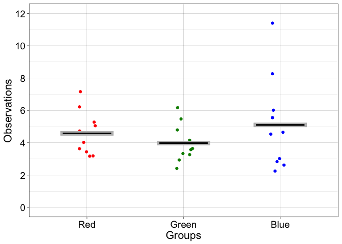

Bordeaux 2019 - robust stats - part 1: introduction
================
Guillaume A. Rousselet
2019-03-25

-   [Rand Wilcox's code](#rand-wilcoxs-code)
-   [Exercise](#exercise)
    -   [Description](#description)
    -   [Data capture](#data-capture)
    -   [Load simulated data](#load-simulated-data)
    -   [Load real data](#load-real-data)
    -   [Illustration](#illustration)
    -   [Inferential statistics?](#inferential-statistics)

``` r
# dependencies
library(ggplot2)
library(tibble)
```

``` r
sessionInfo()
```

    ## R version 3.5.2 (2018-12-20)
    ## Platform: x86_64-apple-darwin15.6.0 (64-bit)
    ## Running under: macOS Mojave 10.14.3
    ## 
    ## Matrix products: default
    ## BLAS: /Library/Frameworks/R.framework/Versions/3.5/Resources/lib/libRblas.0.dylib
    ## LAPACK: /Library/Frameworks/R.framework/Versions/3.5/Resources/lib/libRlapack.dylib
    ## 
    ## locale:
    ## [1] en_GB.UTF-8/en_GB.UTF-8/en_GB.UTF-8/C/en_GB.UTF-8/en_GB.UTF-8
    ## 
    ## attached base packages:
    ## [1] stats     graphics  grDevices utils     datasets  methods   base     
    ## 
    ## other attached packages:
    ## [1] tibble_2.0.1  ggplot2_3.1.0
    ## 
    ## loaded via a namespace (and not attached):
    ##  [1] Rcpp_1.0.0       knitr_1.21       magrittr_1.5     tidyselect_0.2.5
    ##  [5] munsell_0.5.0    colorspace_1.4-0 R6_2.4.0         rlang_0.3.1     
    ##  [9] stringr_1.4.0    plyr_1.8.4       dplyr_0.8.0.1    tools_3.5.2     
    ## [13] grid_3.5.2       gtable_0.2.0     xfun_0.4         withr_2.1.2     
    ## [17] htmltools_0.3.6  assertthat_0.2.0 yaml_2.2.0       lazyeval_0.2.1  
    ## [21] digest_0.6.18    crayon_1.3.4     purrr_0.3.0      glue_1.3.0      
    ## [25] evaluate_0.13    rmarkdown_1.11   stringi_1.3.1    compiler_3.5.2  
    ## [29] pillar_1.3.1     scales_1.0.0     pkgconfig_2.0.2

Rand Wilcox's code
==================

When I mention code from Rand Wilcox, it is available in a giant text file. You access the functions by:

``` r
source("./code/Rallfun-v35.txt")
```

See more detail and updated versions of the code [here](https://dornsife.usc.edu/labs/rwilcox/software/).

Some of the functions are also available in the `WRS2` package.

Exercise
========

Description
-----------

-   Form 3 groups.
-   Each group gets a bag (a population).
-   Pick 10 dice/participants from the bag (sample participants without replacement).
-   Get 5 trials per participant (throw each dice 5 times).

Data capture
------------

Enter the data in R or a text file: 5 rows (trials) and 10 columns (participants).

``` r
# enter data in matrix with 5 rows, 10 columns:

# dice_res[,1] <- c(,,,,)
# dice_res[,2] <- c(,,,,)
# dice_res[,3] <- c(,,,,)
# dice_res[,4] <- c(,,,,)
# dice_res[,5] <- c(,,,,)
# dice_res[,6] <- c(,,,,)
# dice_res[,7] <- c(,,,,)
# dice_res[,8] <- c(,,,,)
# dice_res[,9] <- c(,,,,)
# dice_res[,10] <- c(,,,,)

# Save in a txt file:

# write.table(dice_res, file = "./data/dice_res_blue.txt", row.names=FALSE, col.names=FALSE)
# write.table(dice_res, file = "./data/dice_res_green.txt", row.names=FALSE, col.names=FALSE)
# write.table(dice_res, file = "./data/dice_res_red.txt", row.names=FALSE, col.names=FALSE)

# email me the data: Guillaume.Rousselet@glasgow.ac.uk
```

Load simulated data
-------------------

``` r
nt <- 5
np <- 10
res_red <- matrix(scan("./data/res1.txt"), nrow=nt, byrow=TRUE)
res_green <- matrix(scan("./data/res2.txt"), nrow=nt, byrow=TRUE)
res_blue <- matrix(scan("./data/res3.txt"), nrow=nt, byrow=TRUE)
```

Load real data
--------------

``` r
res_red <- matrix(scan("./data/dice_res_red.txt"), nrow=nt, byrow=TRUE)
res_green <- matrix(scan("./data/dice_res_green.txt"), nrow=nt, byrow=TRUE)
res_blue <- matrix(scan("./data/dice_res_blue.txt"), nrow=nt, byrow=TRUE)
```

Illustration
------------

Mean results

``` r
m.red <- round(apply(res_red, 2, mean), digits=1)
m.green <- round(apply(res_green, 2, mean), digits=1)
m.blue <- round(apply(res_blue, 2, mean), digits=1)
```

Illustrate results

``` r
set.seed(1)
df <- tibble(obs = c(m.red, m.green, m.blue),
             gp = factor(c(rep("Red",np),rep("Green",np),rep("Blue",np)))
             )

# preserve factor order
df$gp <- as.character(df$gp)
df$gp <- factor(df$gp, levels=unique(df$gp))

  ggplot(df, aes(gp, obs)) + theme_linedraw() +
  geom_point(aes(colour = gp), position = position_jitter(width = 0.1)) +
    scale_color_manual(values=c("red", "green4", "blue")) +
  theme(legend.position = "none",
        axis.text = element_text(size = 14),
        axis.title = element_text(size = 16)) +
  labs(x = "Groups", y = "Observations") +   
    coord_cartesian(ylim = c(0, 12)) +
    scale_y_continuous(breaks = seq(0, 12, 2)) +
  geom_errorbar(stat = "summary", fun.y = mean, fun.ymin = mean,
                fun.ymax = mean, colour = "grey", width = .55, size = 3) +
  geom_errorbar(stat = "summary", fun.y = mean, fun.ymin = mean,
                fun.ymax = mean, colour = "black", width = .5, size = 1)
```



Inferential statistics?
-----------------------

What would you do next with the data?
