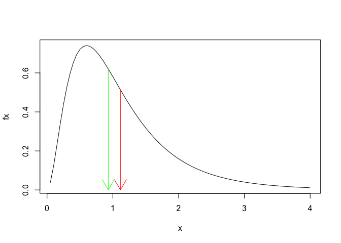

Bordeaux 2019 - robust stats - part 2: robust estimation
================
Guillaume A. Rousselet
2019-03-26

-   [Quantiles](#quantiles)
-   [Discarding outliers](#discarding-outliers)
    -   [Boxplot rule](#boxplot-rule)
    -   [2 SD away from the mean rule](#sd-away-from-the-mean-rule)
    -   [MAD median rule](#mad-median-rule)
-   [Measures of central tendency](#measures-of-central-tendency)
    -   [Mean vs. median](#mean-vs.-median)
    -   [Trimmed means](#trimmed-means)
    -   [Illustrate 20% trimming - F distribution](#illustrate-20-trimming---f-distribution)
    -   [example: get trimmed means of all columns of a matrix](#example-get-trimmed-means-of-all-columns-of-a-matrix)
    -   [Winzorised mean](#winzorised-mean)
    -   [Compare techniques](#compare-techniques)
-   [Tests and confidence intervals for groups](#tests-and-confidence-intervals-for-groups)
    -   [Independent groups](#independent-groups)
    -   [Dependent groups](#dependent-groups)
-   [Effect of outlier on mean and t-test](#effect-of-outlier-on-mean-and-t-test)

``` r
# dependencies
library(ggplot2)
library(tibble)
source('./code/Rallfun-v35.txt')
```

``` r
sessionInfo()
```

    ## R version 3.5.2 (2018-12-20)
    ## Platform: x86_64-apple-darwin15.6.0 (64-bit)
    ## Running under: macOS Mojave 10.14.3
    ## 
    ## Matrix products: default
    ## BLAS: /Library/Frameworks/R.framework/Versions/3.5/Resources/lib/libRblas.0.dylib
    ## LAPACK: /Library/Frameworks/R.framework/Versions/3.5/Resources/lib/libRlapack.dylib
    ## 
    ## locale:
    ## [1] en_GB.UTF-8/en_GB.UTF-8/en_GB.UTF-8/C/en_GB.UTF-8/en_GB.UTF-8
    ## 
    ## attached base packages:
    ## [1] stats     graphics  grDevices utils     datasets  methods   base     
    ## 
    ## other attached packages:
    ## [1] tibble_2.0.1  ggplot2_3.1.0
    ## 
    ## loaded via a namespace (and not attached):
    ##  [1] Rcpp_1.0.0       knitr_1.21       magrittr_1.5     tidyselect_0.2.5
    ##  [5] munsell_0.5.0    colorspace_1.4-0 R6_2.4.0         rlang_0.3.1     
    ##  [9] stringr_1.4.0    plyr_1.8.4       dplyr_0.8.0.1    tools_3.5.2     
    ## [13] grid_3.5.2       gtable_0.2.0     xfun_0.4         withr_2.1.2     
    ## [17] htmltools_0.3.6  assertthat_0.2.0 yaml_2.2.0       lazyeval_0.2.1  
    ## [21] digest_0.6.18    crayon_1.3.4     purrr_0.3.0      glue_1.3.0      
    ## [25] evaluate_0.12    rmarkdown_1.11   stringi_1.3.1    compiler_3.5.2  
    ## [29] pillar_1.3.1     scales_1.0.0     pkgconfig_2.0.2

Here we focus on simple examples: - one-sample - two independent samples - two dependent samples

For inferences on multiple quantiles, see these guides about the [shift function](https://github.com/GRousselet/rogme) and the [hierarchical shift function](https://github.com/GRousselet/rogme/blob/master/docs/hsf.md).

Quantiles
=========

``` r
# check help, many techniques available
xf <- rnorm(100)
quantile(xf)
```

    ##          0%         25%         50%         75%        100% 
    ## -2.08264354 -0.66910707 -0.08219573  0.97198591  3.45536409

``` r
# Harrel-Davis estimator of the quantiles
hd(xf,q=.5) # Harrel-Davis estimate of the median
```

    ## [1] -0.05933721

``` r
# ideal fourths
idealf(xf) # better 1st and 3rd quartiles?
```

    ## $ql
    ## [1] -0.6839323
    ## 
    ## $qu
    ## [1] 0.9804052

Discarding outliers
===================

Obvious example?

``` r
x <- c(2,2,3,3,3,4,4,4,100000,100000)
```

Boxplot rule
------------

``` r
outbox(x)
```

    ## $out.val
    ## [1] 1e+05 1e+05
    ## 
    ## $out.id
    ## [1]  9 10
    ## 
    ## $keep
    ## [1] 1 2 3 4 5 6 7 8
    ## 
    ## $n
    ## [1] 10
    ## 
    ## $n.out
    ## [1] 2
    ## 
    ## $cl
    ## [1] -12498.21
    ## 
    ## $cu
    ## [1] 20838.12

``` r
res<-outbox(x)
xclean<-x[res$keep]
```

2 SD away from the mean rule
----------------------------

``` r
k<-2
res<-(abs(x-mean(x))/sd(x))>k
x[res]
```

    ## numeric(0)

MAD median rule
---------------

``` r
k<-2.24
(abs(x-median(x))/(mad(x)))>k
```

    ##  [1] FALSE FALSE FALSE FALSE FALSE FALSE FALSE FALSE  TRUE  TRUE

``` r
#out(x) # Rand Wilcox's function
```

Measures of central tendency
============================

Mean vs. median
---------------

``` r
x<-seq(0.05,4,0.05)
fx<-df(x,6,18) #fx<-dlnorm(x)
plot(x,fx,type="l")
n<-10000
samp<-rf(n,6,18)
mx<-mean(samp)
mdx<-median(samp)
arrows( mx,df(mx,6,18),mx,0,col='red')
arrows( mdx,df(mdx,6,18),mdx,0,col='green')
```



Trimmed means
-------------

### Illustrate 20% trimming - Normal distribution

``` r
tr<-.2
xv<-seq(-4,4,0.01)
yv<-dnorm(xv)
plot(xv,yv,type="l")
zval<-qnorm(tr, mean = 0, sd = 1, lower.tail = TRUE, log.p = FALSE)
polygon(c(xv[xv<=zval],zval),c(yv[xv<=zval],yv[xv==-4]),col=5)
polygon(c(xv[xv>=-zval],-zval),c(yv[xv>=-zval],yv[xv==4]),col=5)
```


Illustrate 20% trimming - F distribution
----------------------------------------

``` r
tr<-.2
xv<-seq(0.01,4,0.01)
yv<-df(xv,6,18) #fx<-dlnorm(x)
plot(xv,yv,type="l")
zval<-qf(tr,6,18)
polygon(c(xv[xv<=zval],zval),c(yv[xv<=zval],yv[xv==0.01]),col=5)
zval<-qf(1-tr,6,18)
polygon(c(xv[xv>=zval],zval),c(yv[xv>=zval],yv[xv==4]),col=5)
```


example: get trimmed means of all columns of a matrix
-----------------------------------------------------

``` r
set.seed(21)
v <- matrix(rnorm(50), nrow = 10) # reshape into 10 x 5 matrix
apply(v, 2, mean, trim=.2) # compute trimmed mean for each column
```

    ## [1]  0.1457649  0.1962903 -0.3871912  0.6594120  0.1497055

Winzorised mean
---------------

``` r
winmean(x,tr=.2)
```

### Winzorised variance

``` r
winvar(x,tr=.2)
```

### Standard error of the trimmed mean

``` r
trimse(x,tr=.2)
```

Compare techniques
------------------

``` r
self<-t(read.table("./data/self-awareness.csv",header=FALSE))
stripchart(self, method="jitter", pch=1)
```


``` r
cbind(mean=round(mean(self),digits=1),median=median(self),tm=round(mean(self,trim=.2),digits=1))
```

    ##       mean median    tm
    ## [1,] 448.1    262 282.7

Tests and confidence intervals for groups
=========================================

Independent groups
------------------

### Kolmogorov-Smirnov test

See explanation in this [blog post](https://garstats.wordpress.com/2016/05/02/robust-effect-sizes-for-2-independent-groups/).

``` r
ks.test(x, y)
```

### T-tests on means and trimmed means

``` r
yuen(x,y,tr=0.2,alpha=0.05)
# set tr=0 for a t-test on means
# compare output to t.test
```

### Compare medians

``` r
msmed(x,y,alpha=0.05)
```

Dependent groups
----------------

### T-tests on trimmed means

``` r
yuend(x,y,tr=0.2,alpha=0.05)
```

### Compare medians

``` r
# use percentile bootstrap - see part 4
```

Effect of outlier on mean and t-test
====================================

``` r
set.seed(3) # set the seed of the random number generator for reproducibility
data <- rnorm(10, mean = 1, sd = 1) # get random sample from normal population

summary(data)
```

    ##    Min. 1st Qu.  Median    Mean 3rd Qu.    Max. 
    ## -0.2189  0.2054  1.0578  0.9329  1.2430  2.2674

``` r
data2 <- c(data,5)
summary(data2)
```

    ##    Min. 1st Qu.  Median    Mean 3rd Qu.    Max. 
    ## -0.2189  0.3728  1.0854  1.3026  1.6877  5.0000

``` r
x <- list("data"=data, "data2"=data2)
stripchart(x,method="jitter",pch=1)
```


``` r
t.test(data,mu=0)
```

    ## 
    ##  One Sample t-test
    ## 
    ## data:  data
    ## t = 3.4075, df = 9, p-value = 0.00778
    ## alternative hypothesis: true mean is not equal to 0
    ## 95 percent confidence interval:
    ##  0.3135589 1.5521697
    ## sample estimates:
    ## mean of x 
    ## 0.9328643

``` r
t.test(data2,mu=0)
```

    ## 
    ##  One Sample t-test
    ## 
    ## data:  data2
    ## t = 2.9272, df = 10, p-value = 0.01511
    ## alternative hypothesis: true mean is not equal to 0
    ## 95 percent confidence interval:
    ##  0.311072 2.294136
    ## sample estimates:
    ## mean of x 
    ##  1.302604
