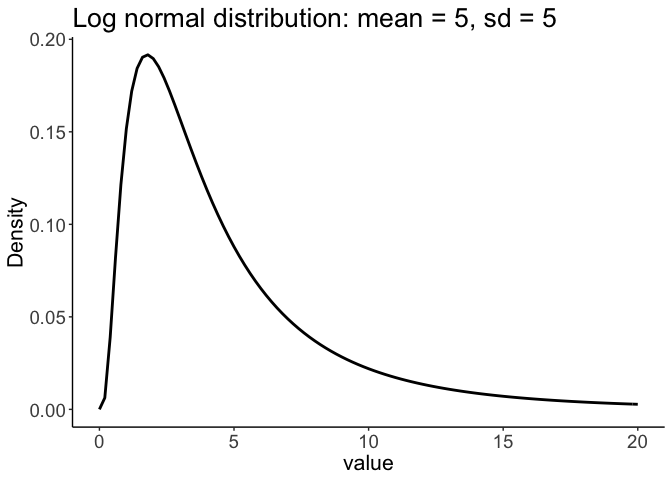
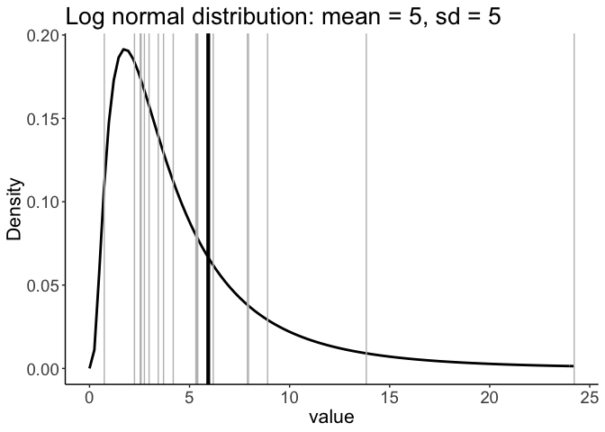

Bordeaux 2019 - robust stats - part 3: sampling distributions
================
Guillaume A. Rousselet
2019-03-26

-   [Standard error of the mean](#standard-error-of-the-mean)
-   [t-test confidence interval](#t-test-confidence-interval)
    -   [Get one sample and apply t.test() function](#get-one-sample-and-apply-t.test-function)
    -   [Compute t value](#compute-t-value)
    -   [t distribution and quantiles](#t-distribution-and-quantiles)
    -   [Compute confidence interval](#compute-confidence-interval)
-   [Example using the lognormal](#example-using-the-lognormal)
    -   [Illustrate lognormal](#illustrate-lognormal)
    -   [One sample from lognormal distribution](#one-sample-from-lognormal-distribution)
    -   [Many samples from lognormal distribution](#many-samples-from-lognormal-distribution)

``` r
# dependencies
library(ggplot2)
library(tibble)
```

``` r
sessionInfo()
```

    ## R version 3.5.2 (2018-12-20)
    ## Platform: x86_64-apple-darwin15.6.0 (64-bit)
    ## Running under: macOS Mojave 10.14.3
    ## 
    ## Matrix products: default
    ## BLAS: /Library/Frameworks/R.framework/Versions/3.5/Resources/lib/libRblas.0.dylib
    ## LAPACK: /Library/Frameworks/R.framework/Versions/3.5/Resources/lib/libRlapack.dylib
    ## 
    ## locale:
    ## [1] en_GB.UTF-8/en_GB.UTF-8/en_GB.UTF-8/C/en_GB.UTF-8/en_GB.UTF-8
    ## 
    ## attached base packages:
    ## [1] stats     graphics  grDevices utils     datasets  methods   base     
    ## 
    ## other attached packages:
    ## [1] tibble_2.0.1  ggplot2_3.1.0
    ## 
    ## loaded via a namespace (and not attached):
    ##  [1] Rcpp_1.0.0       knitr_1.21       magrittr_1.5     tidyselect_0.2.5
    ##  [5] munsell_0.5.0    colorspace_1.4-0 R6_2.4.0         rlang_0.3.1     
    ##  [9] stringr_1.4.0    plyr_1.8.4       dplyr_0.8.0.1    tools_3.5.2     
    ## [13] grid_3.5.2       gtable_0.2.0     xfun_0.4         withr_2.1.2     
    ## [17] htmltools_0.3.6  assertthat_0.2.0 yaml_2.2.0       lazyeval_0.2.1  
    ## [21] digest_0.6.18    crayon_1.3.4     purrr_0.3.0      glue_1.3.0      
    ## [25] evaluate_0.12    rmarkdown_1.11   stringi_1.3.1    compiler_3.5.2  
    ## [29] pillar_1.3.1     scales_1.0.0     pkgconfig_2.0.2

``` r
# population
m <- 50
sd <- 10
ggplot(data.frame(x = c(0, 100)), aes(x)) + theme_linedraw() +
  stat_function(fun = dnorm, args = list(mean = m, sd = sd)) + 
labs(y = "Density") +
  theme(axis.text = element_text(size = 14),
        axis.title = element_text(size = 16),
        plot.title = element_text(size=20)) +
  ggtitle(paste0("Normal distribution: mean = ",m,", sd = ",sd))
```


``` r
# ggsave(filename = "b3_normdist.pdf")
```

``` r
# one sample
set.seed(4)
n <- 20
samp <- rnorm(n, m, sd)
ggplot(data.frame(x = c(0, 100)), aes(x)) + theme_linedraw() +
  stat_function(fun = dnorm, args = list(mean = m, sd = sd)) +
  geom_vline(xintercept = samp, colour = "grey") + 
labs(y = "Density") +
  theme(axis.text = element_text(size = 14),
        axis.title = element_text(size = 16),
        plot.title = element_text(size=20)) +
  ggtitle(paste0("Normal distribution: mean = ",m,", sd = ",sd))
```


``` r
# ggsave(filename = "b3_normdist_1samp.pdf")
```

``` r
# one sample + mean
set.seed(4)
n <- 20
samp <- rnorm(n, m, sd)
ggplot(data.frame(x = c(0, 100)), aes(x)) + theme_linedraw() +
  stat_function(fun = dnorm, args = list(mean = m, sd = sd)) +
  geom_vline(xintercept = samp, colour = "grey") +
  geom_vline(xintercept = mean(samp), size = 2) + 
labs(y = "Density") +
  theme(axis.text = element_text(size = 14),
        axis.title = element_text(size = 16),
        plot.title = element_text(size=20)) +
  ggtitle(paste("Sample mean =",round(mean(samp),digits=1),", sd = ",round(sd(samp),digits=1)))
```


``` r
# ggsave(filename = "b3_normdist_1samp_mean.pdf")
```

``` r
# sampling distribution
set.seed(111) 
n <- 20
nsim <- 10000
samp.dist <- apply(matrix(rnorm(n*nsim, m, sd),nrow = nsim), 1, mean)

ggplot(data.frame(x=samp.dist), aes(x)) + theme_linedraw() +
  geom_histogram(aes(y = ..density..), colour = "black", fill = "white", bins = 50) +
  theme(axis.text = element_text(size = 14),
        axis.title = element_text(size = 16),
        plot.title = element_text(size=20)) +
  ggtitle(paste(nsim,"sample means: mean =",round(mean(samp.dist),digits=1),", sd = ",round(sd(samp.dist),digits=2)))
```


``` r
# ggsave(filename = "b3_normdist_10000samp_mean.pdf")
```

Standard error of the mean
==========================

SEM = population sd / sqrt(n)

Usually estimated using sample sd / sqrt(n)

``` r
sd(samp) / sqrt(length(samp))
```

    ## [1] 1.791763

SEM = sd of sampling distribution of the sample mean

<https://www.khanacademy.org/math/ap-statistics/sampling-distribution-ap/sampling-distribution-mean/v/standard-error-of-the-mean>

``` r
sd(samp.dist)
```

    ## [1] 2.255003

t-test confidence interval
==========================

Get one sample and apply t.test() function
------------------------------------------

``` r
# one sample
set.seed(4)
n <- 20
samp <- rnorm(n, m, sd)
t.test(samp)
```

    ## 
    ##  One Sample t-test
    ## 
    ## data:  samp
    ## t = 30.006, df = 19, p-value < 2.2e-16
    ## alternative hypothesis: true mean is not equal to 0
    ## 95 percent confidence interval:
    ##  50.01276 57.51317
    ## sample estimates:
    ## mean of x 
    ##  53.76296

Compute t value
---------------

``` r
# Formula
samp.m <- mean(samp) # sample mean
samp.v <- var(samp) # sample variance
sem <- sqrt(samp.v/n) # standard error of the mean
samp.t <- samp.m / sem
samp.t
```

    ## [1] 30.00562

t distribution and quantiles
----------------------------

``` r
alpha <- 0.05 # expected long term false positive rate
df <- length(samp) - 1 # degrees of freedom
ggplot(data.frame(x = c(-5, 5)), aes(x)) + theme_linedraw() +
  stat_function(fun = dt, args = list(df = df)) + 
labs(y = "Density") +
  theme(axis.text = element_text(size = 14),
        axis.title = element_text(size = 16),
        plot.title = element_text(size=20)) +
  ggtitle(paste0("t distribution: df = ",df,", ",(1-alpha/2)*100,"th quantile = ",round(qt(1-alpha/2, df), digits=2))) +
  geom_vline(xintercept = c(-qt(1-alpha/2, df), qt(1-alpha/2, df)), colour = "green", size = 1)
```


Compute confidence interval
---------------------------

``` r
alpha <- 0.05
df <- n-1 # degrees of freedom
ci <- vector("numeric",2)
ci[1] <- samp.m - qt(1-alpha/2, df)  * sem
ci[2] <- samp.m + qt(1-alpha/2, df)  * sem
ci
```

    ## [1] 50.01276 57.51317

Example using the lognormal
===========================

[Blog post](https://msalganik.wordpress.com/2017/01/21/making-sense-of-the-rlnorm-function-in-r/) on how to use `rlnorm()`.

Illustrate lognormal
--------------------

``` r
# population
m <- 5
s <- 5
location <- log(m^2 / sqrt(s^2 + m^2))
shape <- sqrt(log(1 + (s^2 / m^2)))
x <- seq(0, 20, .05)
ggplot(as_tibble(x), aes(value)) +
  theme_linedraw() +
  stat_function(fun = dlnorm, args = list(meanlog = location, sdlog = shape), size = 1) +
  labs(y = "Density") +
  theme(axis.title = element_text(size = 16),
        axis.text = element_text(size = 14),
        plot.title = element_text(size=20)) +
  ggtitle(paste0("Log normal distribution: mean = ",m,", sd = ",sd))
```

    ## Warning: Calling `as_tibble()` on a vector is discouraged, because the behavior is likely to change in the future. Use `enframe(name = NULL)` instead.
    ## This warning is displayed once per session.



``` r
# ggsave(filename = "b3_lnormdist.pdf")
```

One sample from lognormal distribution
--------------------------------------

``` r
set.seed(777)
n <- 20
samp <- rlnorm(n, meanlog = location, sdlog = shape)
x <- seq(0, 20, .05)
ggplot(as_tibble(x), aes(value)) +
  theme_linedraw() +
  stat_function(fun = dlnorm, args = list(meanlog = location, sdlog = shape), size = 1) +
  geom_vline(xintercept = samp, colour = "grey") + 
  geom_vline(xintercept = mean(samp), size = 1.5) + 
labs(y = "Density") +
  theme(axis.text = element_text(size = 14),
        axis.title = element_text(size = 16),
        plot.title = element_text(size=20)) +
  ggtitle(paste0("Log normal distribution: mean = ",m,", sd = ",sd))
```



``` r
# ggsave(filename = "b3_lnormdist_1samp.pdf")
```

Many samples from lognormal distribution
----------------------------------------

``` r
set.seed(777)
m <- 5
s <- 5
location <- log(m^2 / sqrt(s^2 + m^2))
shape <- sqrt(log(1 + (s^2 / m^2)))

# population mean?
lnorm.pop.m <- mean(rlnorm(1000000, meanlog = location, sdlog = shape))

n <- 20
nsamp <- 10000
# nsamp experiments in one go + compute mean for each one:
dist.samp <- apply(matrix(rlnorm(n*nsamp, meanlog = location, sdlog = shape), nrow = nsamp), 1, mean)

v <- as_tibble(dist.samp) 
ggplot(v, aes(x = value)) + theme_linedraw() +
        geom_histogram(aes(y = ..density..), colour = "black", fill = "white", bins = 50) +
  # geom_vline(xintercept = mean(dist.samp), size = 1.5) + 
  theme(axis.text = element_text(size = 14),
        axis.title = element_text(size = 16),
        plot.title = element_text(size=20)) +
  ggtitle(paste(nsim,"sample means: mean =",round(mean(dist.samp),digits=1),", sd = ",round(sd(dist.samp),digits=2)))
```


``` r
# ggsave(filename = "b3_lnormdist_10000samp_mean.pdf")
```
