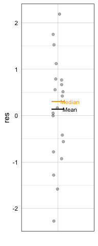
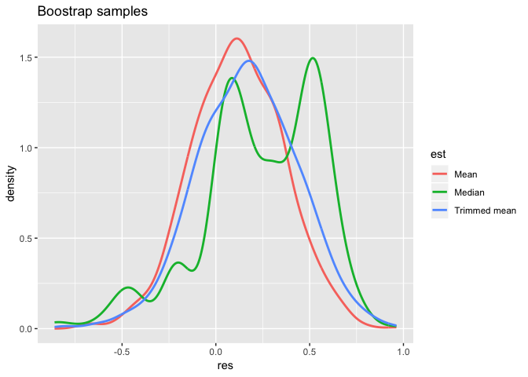
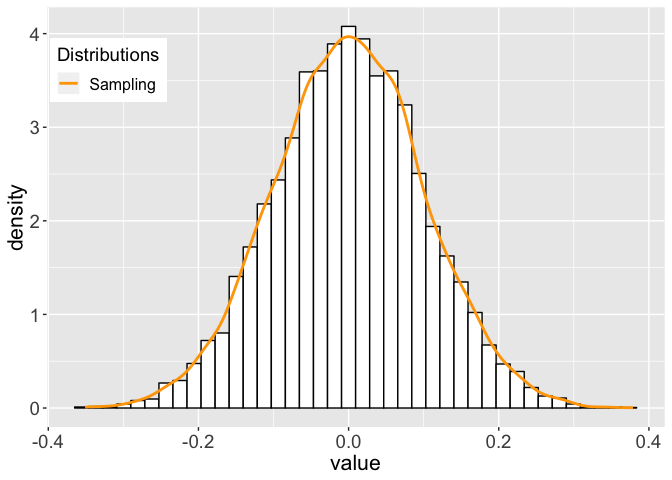
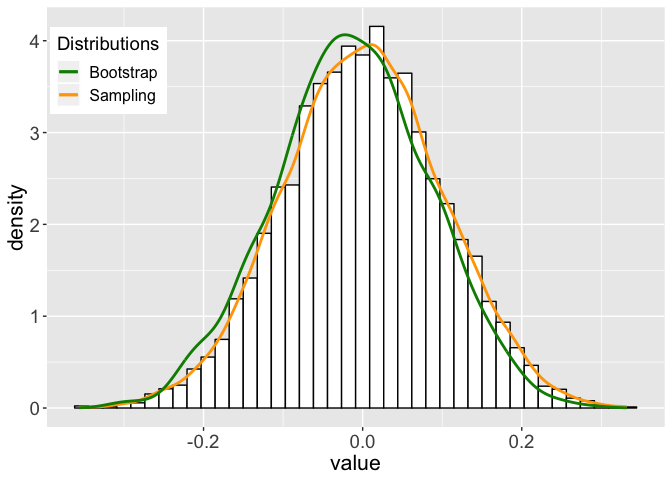
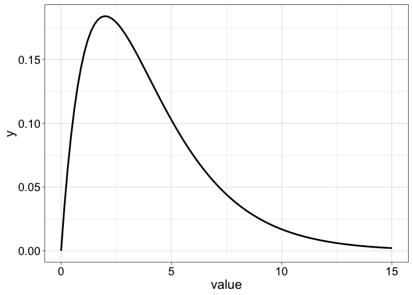
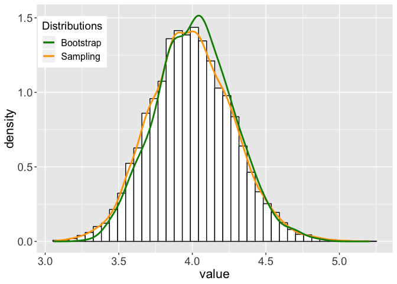
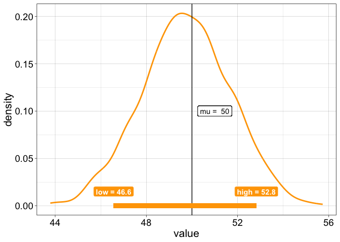

Bordeaux 2019 - robust stats - part 4: percentile bootstrap
================
Guillaume A. Rousselet
2019-03-26

-   [Bootstrap implementation](#bootstrap-implementation)
    -   [Sampling with replacement](#sampling-with-replacement)
    -   [Loop](#loop)
    -   [Matrix](#matrix)
    -   [Functions](#functions)
-   [Bootstrap sampling distribution](#bootstrap-sampling-distribution)
    -   [Example 1: sample from normal distribution](#example-1-sample-from-normal-distribution)
    -   [Example 2: sample from gamma distribution](#example-2-sample-from-gamma-distribution)
-   [Bootstrap confidence interval](#bootstrap-confidence-interval)
    -   [Graphical representation](#graphical-representation)
    -   [Check standard confidence interval](#check-standard-confidence-interval)
-   [Bootstrap group comparison](#bootstrap-group-comparison)

``` r
# dependencies
library(ggplot2)
library(tibble)
source('./code/Rallfun-v35.txt')
```

``` r
sessionInfo()
```

    ## R version 3.5.2 (2018-12-20)
    ## Platform: x86_64-apple-darwin15.6.0 (64-bit)
    ## Running under: macOS Mojave 10.14.3
    ## 
    ## Matrix products: default
    ## BLAS: /Library/Frameworks/R.framework/Versions/3.5/Resources/lib/libRblas.0.dylib
    ## LAPACK: /Library/Frameworks/R.framework/Versions/3.5/Resources/lib/libRlapack.dylib
    ## 
    ## locale:
    ## [1] en_GB.UTF-8/en_GB.UTF-8/en_GB.UTF-8/C/en_GB.UTF-8/en_GB.UTF-8
    ## 
    ## attached base packages:
    ## [1] stats     graphics  grDevices utils     datasets  methods   base     
    ## 
    ## other attached packages:
    ## [1] tibble_2.0.1  ggplot2_3.1.0
    ## 
    ## loaded via a namespace (and not attached):
    ##  [1] Rcpp_1.0.0       knitr_1.21       magrittr_1.5     tidyselect_0.2.5
    ##  [5] munsell_0.5.0    colorspace_1.4-0 R6_2.4.0         rlang_0.3.1     
    ##  [9] stringr_1.4.0    plyr_1.8.4       dplyr_0.8.0.1    tools_3.5.2     
    ## [13] grid_3.5.2       gtable_0.2.0     xfun_0.4         withr_2.1.2     
    ## [17] htmltools_0.3.6  assertthat_0.2.0 yaml_2.2.0       lazyeval_0.2.1  
    ## [21] digest_0.6.18    crayon_1.3.4     purrr_0.3.0      glue_1.3.0      
    ## [25] evaluate_0.12    rmarkdown_1.11   stringi_1.3.1    compiler_3.5.2  
    ## [29] pillar_1.3.1     scales_1.0.0     pkgconfig_2.0.2

Bootstrap implementation
========================

Sampling with replacement
-------------------------

Test the `sample()` function. Let say our sample is a sequence of integers. We sample with replacement from that sequence of numbers. Execute chunk several times to see what happens.

``` r
n <- 10 # sample size
samp <- 1:n
boot.samp <- sample(samp, n, replace = TRUE) # sample with replacement
boot.samp
```

    ##  [1]  1  8  1  9  2  8  2  5  9 10

Loop
----

``` r
set.seed(21) # reproducible results
n <- 20 # sample size
samp <- rnorm(n) # get normal sample
nboot <- 1000 # number of bootstrap samples
# declare vector of results
boot.m <- vector(mode = "numeric", length = nboot) # save means
boot.tm <- vector(mode = "numeric", length = nboot) # save trimmed means
boot.md <- vector(mode = "numeric", length = nboot) # save medians
for(B in 1:nboot){
  boot.samp <- sample(samp, n, replace = TRUE) # sample with replacement
  boot.m[B] <- mean(boot.samp)
  boot.tm[B] <- mean(boot.samp, trim = 0.2)
  boot.md[B] <- median(boot.samp)
}
samp.m <- mean(samp)
samp.tm <- mean(samp, trim = 0.2)
samp.md <- median(samp)
samp.m
```

    ## [1] 0.1363416

``` r
samp.tm
```

    ## [1] 0.1835497

``` r
samp.md
```

    ## [1] 0.3028401

### Plot original results

``` r
set.seed(1)
df <- tibble(cond = factor(rep(1,n)),
             res = samp) 
ggplot(df, aes(x = cond, y = res)) + theme_linedraw() + 
  geom_jitter(width = 0.1, alpha = 0.3) +
  theme(axis.text.x = element_blank(),
    axis.ticks = element_blank()) +
  scale_x_discrete(name ="") +
  # stat_summary(fun.y=median, geom="line")
  geom_segment(aes(x = 0.9, y = samp.m, xend = 1.1, yend = samp.m)) +
  geom_segment(aes(x = 0.9, y = samp.md, xend = 1.1, yend = samp.md), colour = "orange") +
  annotate("text", x = 1.2, y = samp.m, label = "Mean", size = 3) +
  annotate("text", x = 1.2, y = samp.md, label = "Median", size = 3, colour = "orange")
```



### Plot bootstrap results

``` r
df <- tibble(res = c(boot.m, boot.tm, boot.md),
             est = factor(c(rep("Mean",nboot), rep("Trimmed mean",nboot), rep("Median",nboot)))
             )
ggplot(df, aes(x = res, colour = est)) +
  geom_line(aes(y = ..density..), stat = "density", size = 1) +
  ggtitle("Boostrap samples")
```



Matrix
------

``` r
set.seed(21) # reproducible results
n <- 20 # sample size
samp <- rnorm(n) # get normal sample
nboot <- 1000 # number of bootstrap samples
# sample with replacement + reoganise into a matrix
boot.samp <- matrix(sample(samp, n*nboot, replace = TRUE), nrow = nboot)
boot.m <- apply(boot.samp, 1, mean)
boot.md <- apply(boot.samp, 1, median)
```

Functions
---------

Check out for instance the [*boot* package](https://www.statmethods.net/advstats/bootstrapping.html) and the [*resample* package](https://cran.r-project.org/web/packages/resample/index.html)

Functions from Rand Wilcox

``` r
# source('./code/Rallfun-v35.txt')
onesampb(samp, est=mean, alpha=0.1, nboot=1000, SEED = FALSE, nv = 0)
```

    ## $ci
    ## [1] -0.2710974  0.5186691
    ## 
    ## $n
    ## [1] 20
    ## 
    ## $estimate
    ## [1] 0.1363416
    ## 
    ## $p.value
    ## [1] 0.6

``` r
# est  = estimator, could be var, mad, to use a trimmed mean, add argument trim = 0.2
# onesampb(samp, est=mean, alpha=0.1, nboot=1000, SEED = FALSE, nv = 0, trim = 0.1)
# nv = null value for NHST
# always set SEED to FALSE otherwise the function always returns the same results for a given input.
# the only way to understand the code is to look at it: edit(onesampb)

# for inferences on trimmed means only:
# trimpb()

# for inferences on the Harrell-Davis quantile estimator (default q=0.5 = median):
# hdpb()
```

Bootstrap sampling distribution
===============================

Example 1: sample from normal distribution
------------------------------------------

### Sampling distribution

``` r
set.seed(777)
n <- 100 # sample size
nsamp <- 10000 # number of samples (experiments)
# sampling distribution of the mean
dist.samp <- apply(matrix(rnorm(n*nsamp), nrow = nsamp), 1, mean)
v <- enframe(dist.samp, name = NULL) 
ggplot(v, aes(x = value)) +
        geom_histogram(aes(y = ..density..), 
                       bins = 40,  colour = "black", fill = "white") +
        geom_line(aes(y = ..density.., colour = 'Sampling'), stat = 'density', size = 1) +     
        scale_colour_manual(name = "Distributions", values = "orange1") +
  theme(legend.position = c(0.1, 0.85),
        axis.title = element_text(size = 16),
        axis.text = element_text(size = 14),
        legend.text = element_text(size = 12),
      legend.title = element_text(size = 14)
       )
```



``` r
# ggsave(filename = './norm_samp_dist.pdf')
```

### Sampling distribution + bootstrap distribution

The bootstrap distribution can approximate the sampling distribution very well for n = 100 and nboot = 1000. Comment out set.seed, so that different random numbers are generated each time you run the chunk. What happens for different random samples?

What happens for lower values of n and nboot? What do you conclude?

``` r
set.seed(777)
n <- 100 # sample size 
samp <- rnorm(n) # create sample from normal population
nboot <- 1000 # number of bootstrap samples
nsamp <- 10000 # number of samples (experiments)
# bootstrap distribution
boot.samp <- apply(matrix(sample(samp, n*nboot, replace = TRUE), nrow = nboot), 1, mean)
# sampling distribution of the mean
dist.samp <- apply(matrix(rnorm(n*nsamp), nrow = nsamp), 1, mean)
v <- enframe(dist.samp, name = NULL) 
ggplot(v, aes(x = value)) +
        geom_histogram(aes(y = ..density..), 
                       bins = 40,  colour = "black", fill = "white") +
        geom_line(aes(y = ..density.., colour = 'Sampling'), stat = 'density', size = 1) +     
        # stat_function(fun = dnorm, aes(colour = 'Normal'),
        #                  args = list(mean = mean(boot.samp), sd = sd(boot.samp)), size = 1) +
        geom_line(data = as_tibble(boot.samp),  
                  aes(x = value, y = ..density.., colour = 'Bootstrap'), 
                  stat = 'density', size = 1) +
        scale_colour_manual(name = "Distributions", values = c("green4", "orange1")) +
  theme(legend.position = c(0.1, 0.85),
        axis.title = element_text(size = 16),
        axis.text = element_text(size = 14),
        legend.text = element_text(size = 12),
      legend.title = element_text(size = 14)
       )
```

    ## Warning: Calling `as_tibble()` on a vector is discouraged, because the behavior is likely to change in the future. Use `enframe(name = NULL)` instead.
    ## This warning is displayed once per session.



``` r
# ggsave(filename = './norm_samp_dist_boot.pdf')
```

Example 2: sample from gamma distribution
-----------------------------------------

Check shape of gamme distribution

``` r
x <- seq(0, 15, .05)
ggplot(as_tibble(x), aes(value)) +
  theme_linedraw() +
  stat_function(fun = dgamma, args = list(shape = 2, scale = 2), size = 1) +
  theme(axis.title = element_text(size = 16),
        axis.text = element_text(size = 14))
```



``` r
# ggsave(filename = './gamma_dist.pdf')
```

``` r
set.seed(777) 
n <- 100
gamma_shape <- 2
gamma_scale <- 2
# sample n trials from gamma distribution
samp <- rgamma(n, shape = gamma_shape, scale = gamma_scale)
nboot <- 1000
nsamp <- 10000
# bootstrap distribution
boot.samp <- apply(matrix(sample(samp, n*nboot, replace = TRUE), nrow = nboot), 1, mean)
# sampling distribution of the mean of n trials from gamma distribution
dist.samp <- apply(matrix(rgamma(n*nsamp, shape = gamma_shape, scale = gamma_scale), nrow = nsamp), 1, mean)
v <- enframe(dist.samp, name = NULL) 
ggplot(v, aes(x = value)) +
        geom_histogram(aes(y = ..density..), 
                       bins = 40,  colour = "black", fill = "white") +
        geom_line(aes(y = ..density.., colour = 'Sampling'), stat = 'density', size = 1) +     
        # stat_function(fun = dnorm, aes(colour = 'Normal'),
        #                  args = list(mean = mean(boot.samp), sd = sd(boot.samp)), size = 1) +
        geom_line(data = as_tibble(boot.samp),  
                  aes(x = value, y = ..density.., colour = 'Bootstrap'), 
                  stat = 'density', size = 1) +
        scale_colour_manual(name = "Distributions", values = c("green4", "orange1")) +
  theme(legend.position = c(0.1, 0.85),
        axis.title = element_text(size = 16),
        axis.text = element_text(size = 14),
        legend.text = element_text(size = 12),
      legend.title = element_text(size = 14)
       )
```



``` r
# ggsave(filename = './gamma_samp_dist_boot.pdf')
```

Bootstrap confidence interval
=============================

``` r
nboot <- 1000
alpha <- .1
lo <- nboot*(alpha/2)
hi <- nboot - lo
lo <- lo + 1

set.seed(777) 
n <- 100
n.m <- 50 # mean of normal distribution
n.sd <- 20 # sd of normal distribution
samp <- rnorm(n, m = n.m, sd = n.sd)
# bootstrap distribution
boot.samp <- apply(matrix(sample(samp, n*nboot, replace = TRUE), nrow = nboot), 1, mean)
# confidence interval
sort.boot.samp <- sort(boot.samp) # sort bootstrap estimates
ci <- vector(mode = "numeric", length = 2)
ci[1] <- sort.boot.samp[lo]
ci[2] <- sort.boot.samp[hi]
```

Graphical representation
------------------------

``` r
ggplot(enframe(boot.samp, name = NULL), aes(x = value)) +
        theme_linedraw() +
        geom_line(aes(y = ..density..), stat = 'density', size = 1, colour = "orange1") +
        # geom_density(size = 1, colour = "orange1") +     
        geom_vline(xintercept = n.m) + # population mean
        geom_label(x = n.m + 1, y = 0.1, label = paste("mu = ",n.m)) +
        geom_segment(aes(x = ci[1], y = 0, xend = ci[2], yend = 0), size = 3, colour = "orange1") + # confidence interval
        geom_label(x = ci[1], y = 0.015, label = paste("low =",round(ci[1], digits=1)),
    fill = "orange1", fontface = "bold", colour = "white") +
  geom_label(x = ci[2], y = 0.015, label = paste("high =",round(ci[2], digits=1)),
    fill = "orange1", fontface = "bold", colour = "white") +
  theme(legend.position = "none",
        axis.title = element_text(size = 16),
        axis.text = element_text(size = 14),
        legend.text = element_text(size = 12),
        legend.title = element_text(size = 14)
       )
```



``` r
ggsave(filename = './pb_ci.pdf')
```

    ## Saving 7 x 5 in image

Check standard confidence interval
----------------------------------

How do they compare?

``` r
t.test(samp, conf.level = 1-alpha)
```

    ## 
    ##  One Sample t-test
    ## 
    ## data:  samp
    ## t = 25.914, df = 99, p-value < 2.2e-16
    ## alternative hypothesis: true mean is not equal to 0
    ## 90 percent confidence interval:
    ##  46.63116 53.01574
    ## sample estimates:
    ## mean of x 
    ##  49.82345

Bootstrap group comparison
==========================

Exercise: compute bootstrap confidence interval for the difference between two groups of the dice data.

You could do it by hand by re-using the chunk of code from the start.

Or use Wilcox's functions for independent groups

``` r
# to compare any estimators
pb2gen(x, y, alpha=0.05, nboot=1000, est=median, SEED=FALSE)
# same as pb2gen but only to compare medians:
medpb2()
# same as pb2gen but only to compare trimmed means:
trimpb2()
# to compare variances:
comvar2()
# For robust measures of scale, use pb2gen
```

Dependent groups

``` r
# percentile bootstrap using any estimator
# default to difference scores - dif=TRUE
bootdpci(x,y,est=median)
# to compare two variances
comdvar(x,y,alpha=0.05)
```
