Bordeaux 2019 - robust stats - part 4: percentile bootstrap - confidence interval variability
================
Guillaume A. Rousselet
2019-03-26

-   [Confidence interval variability](#confidence-interval-variability)
    -   [Sample from a normal distribution](#sample-from-a-normal-distribution)
    -   [Sample from a normal distribution + outlier](#sample-from-a-normal-distribution-outlier)
    -   [Sample from a gamma distribution + bootstrap CI](#sample-from-a-gamma-distribution-bootstrap-ci)
-   [Take-home exercises](#take-home-exercises)

``` r
# dependencies
library(ggplot2)
library(tibble)
```

``` r
sessionInfo()
```

    ## R version 3.5.2 (2018-12-20)
    ## Platform: x86_64-apple-darwin15.6.0 (64-bit)
    ## Running under: macOS Mojave 10.14.3
    ## 
    ## Matrix products: default
    ## BLAS: /Library/Frameworks/R.framework/Versions/3.5/Resources/lib/libRblas.0.dylib
    ## LAPACK: /Library/Frameworks/R.framework/Versions/3.5/Resources/lib/libRlapack.dylib
    ## 
    ## locale:
    ## [1] en_GB.UTF-8/en_GB.UTF-8/en_GB.UTF-8/C/en_GB.UTF-8/en_GB.UTF-8
    ## 
    ## attached base packages:
    ## [1] stats     graphics  grDevices utils     datasets  methods   base     
    ## 
    ## other attached packages:
    ## [1] tibble_2.0.1  ggplot2_3.1.0
    ## 
    ## loaded via a namespace (and not attached):
    ##  [1] Rcpp_1.0.0       knitr_1.21       magrittr_1.5     tidyselect_0.2.5
    ##  [5] munsell_0.5.0    colorspace_1.4-0 R6_2.4.0         rlang_0.3.1     
    ##  [9] stringr_1.4.0    plyr_1.8.4       dplyr_0.8.0.1    tools_3.5.2     
    ## [13] grid_3.5.2       gtable_0.2.0     xfun_0.4         withr_2.1.2     
    ## [17] htmltools_0.3.6  assertthat_0.2.0 yaml_2.2.0       lazyeval_0.2.1  
    ## [21] digest_0.6.18    crayon_1.3.4     purrr_0.3.0      glue_1.3.0      
    ## [25] evaluate_0.12    rmarkdown_1.11   stringi_1.3.1    compiler_3.5.2  
    ## [29] pillar_1.3.1     scales_1.0.0     pkgconfig_2.0.2

This section is concerned with the long term performance of our methods, looking in particular at the behaviour of confidence intervals. The demonstrations and exercises proposed here could be expanded by considering the simulations and results from this article: [What Teachers Should Know About the Bootstrap: Resampling in the Undergraduate Statistics Curriculum](https://amstat.tandfonline.com/doi/abs/10.1080/00031305.2015.1089789#.XJjIty2cbUI)

Confidence interval variability
===============================

We perform many experiments, and for each experiment we compute a confidence interval, which we plot as horizontal lines.

Sample from a normal distribution
---------------------------------

``` r
nboot <- 1000
alpha <- .1
lo <- nboot*(alpha/2)
hi <- nboot - lo
lo <- lo + 1

nexp <- 50 # number of experiments
n <- 20 # sample size in each experiment
n.m <- 50 # mean of normal distribution 
n.sd <- 20 # sd of normal distribution
ci <- matrix(NA, nrow = nexp, ncol = 2)
ci.ttest <- matrix(NA, nrow = nexp, ncol = 2)
for(E in 1:nexp){
  # sample data + bootstrap + compute mean of each bootstrap sample
  samp <- rnorm(n, n.m, n.sd)
  boot.samp <- apply(matrix(sample(samp, n*nboot, replace = TRUE), nrow = nboot), 1, mean)
  sort.boot.samp <- sort(boot.samp) # sort bootstrap estimates
  ci[E,1] <- sort.boot.samp[lo] 
  ci[E,2] <- sort.boot.samp[hi]
  ci.ttest[E,] <- t.test(samp, conf.level = 1-alpha)$conf.int
}
```

### Illustrate results: bootstrap

``` r
# fig.height=3, fig.width=2
df <- tibble(x = as.vector(ci),
             y = rep(1:nexp,2),
             gr = factor(rep(1:nexp,2))
            )
ggplot(df, aes(x = x, y = y)) + theme_linedraw() +
  geom_point() +
  geom_line(aes(group = gr)) +
  geom_vline(xintercept = n.m, colour = "red") +
  labs(x = "Values", y = "Experiments") +
  theme(axis.title = element_text(size = 16),
        axis.text = element_text(size = 14))
```

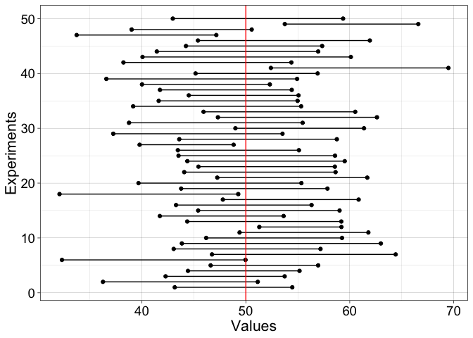

``` r
# https://stackoverflow.com/questions/12253239/vertical-lines-between-points-with-ggplot2
# ggsave(filename = './50expt_bootci.pdf')
```

### Illustrate results: t-test

``` r
# fig.height=3, fig.width=2
df <- tibble(x = as.vector(ci.ttest),
             y = rep(1:nexp,2),
             gr = factor(rep(1:nexp,2))
            )
ggplot(df, aes(x = x, y = y)) + theme_linedraw() +
  geom_point() +
  geom_line(aes(group = gr)) +
  geom_vline(xintercept = n.m, colour = "red") +
  labs(x = "Values", y = "Experiments") +
  theme(axis.title = element_text(size = 16),
        axis.text = element_text(size = 14))
```

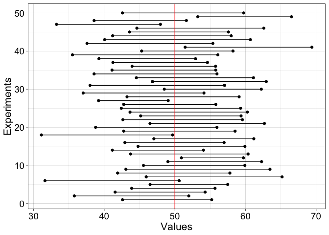

``` r
# ggsave(filename = './50expt_ttci.pdf')
```

### Illustrate results: bootstrap vs. t-test

``` r
# fig.height=3, fig.width=2
dof <- 0.1 # dodge factor
df <- tibble(x = c(as.vector(ci[,1]),as.vector(ci.ttest[,1])),
             xend = c(as.vector(ci[,2]),as.vector(ci.ttest[,2])),
             y = c((1:nexp)-dof,(1:nexp)+dof),
             yend = c((1:nexp)-dof,(1:nexp)+dof),
             gr = factor(rep(1:nexp,2)),
             ci = factor(c(rep('bootstrap',nexp), rep('ttest',nexp)))
            )

ggplot(df, aes(x = x, y = y, xend = xend, yend = yend, colour = ci, group = gr)) + 
  theme_linedraw() +
  geom_segment() +
  scale_size_manual(values = c(1,0.5)) +
  geom_vline(xintercept = n.m, colour = "red") +
  labs(x = "Values", y = "Experiments") +
  theme(axis.title = element_text(size = 16),
        axis.text = element_text(size = 14))
```

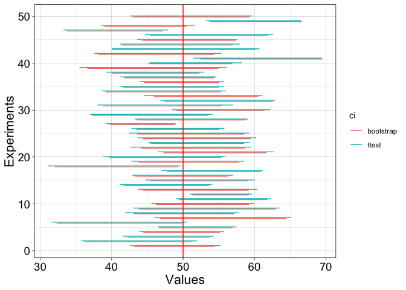

``` r
# ggsave(filename = './50expt_compci.pdf')
```

### Width variability

Let's get more data

``` r
set.seed(21)

nboot <- 200
alpha <- .1
lo <- nboot*(alpha/2)
hi <- nboot - lo
lo <- lo + 1

nexp <- 1000 # number of experiments
n <- 20 # sample size in each experiment
n.m <- 50 # mean of normal distribution 
n.sd <- 20 # sd of normal distribution
ci <- matrix(NA, nrow = nexp, ncol = 2)
ci.ttest <- matrix(NA, nrow = nexp, ncol = 2)
for(E in 1:nexp){
  # sample data + bootstrap + compute mean of each bootstrap sample 
  samp <- rnorm(n, n.m, n.sd)
  boot.samp <- apply(matrix(sample(samp, n*nboot, replace = TRUE), nrow = nboot), 1, mean)
  sort.boot.samp <- sort(boot.samp) # sort bootstrap estimates
  ci[E,1] <- sort.boot.samp[lo] 
  ci[E,2] <- sort.boot.samp[hi]
  ci.ttest[E,] <- t.test(samp, conf.level = 1-alpha)$conf.int
}
```

Illustrate distribution of the width of the confidence intervals

``` r
df <- tibble(value = c(as.vector(ci[,2]-ci[,1]),
                       as.vector(ci.ttest[,2]-ci.ttest[,1])),
             ci = c(rep("bootstrap", nexp),rep("t-test", nexp))
             )
ggplot(df, aes(x = value, colour = ci)) +
  theme_linedraw() +
  geom_line(aes(y = ..density..), stat = 'density', size = 1) +
   theme(legend.position = c(0.1, 0.85),
        axis.title = element_text(size = 16),
        axis.text = element_text(size = 14),
        legend.text = element_text(size = 12),
      legend.title = element_text(size = 14)
       ) +
  scale_colour_manual(name = "Conf. int.", values = c("orange1", "blue")) +
  coord_cartesian(xlim = c(0, 35))
```

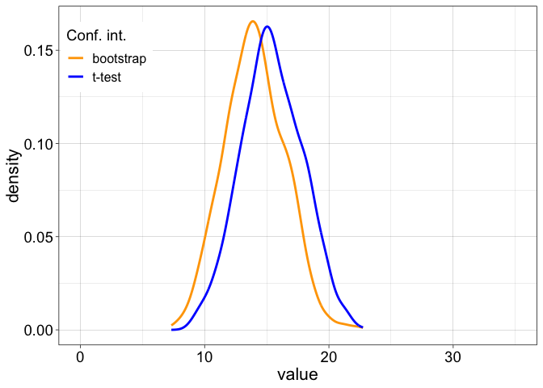

What happens if you change the sample size? What happens if you decrease the number of boostrap samples? For instance, try nboot = 50.

### Coverage

How often does the confidence interval contain the population value? Is it as the nominal (expected) value?

``` r
mean(n.m > ci[,1] & n.m < ci[,2])
```

    ## [1] 0.882

### Coverage of standard confidence interval

How often does the confidence interval contain the population value? Is it as the nominal (expected) value?

``` r
mean(n.m > ci.ttest[,1] & n.m < ci.ttest[,2])
```

    ## [1] 0.915

Sample from a normal distribution + outlier
-------------------------------------------

``` r
nboot <- 1000
alpha <- .1
lo <- nboot*(alpha/2)
hi <- nboot - lo
lo <- lo + 1

nexp <- 50 # number of experiments
n <- 20 # sample size in each experiment
n.m <- 50 # mean of normal distribution 
n.sd <- 20 # sd of normal distribution
ci <- matrix(NA, nrow = nexp, ncol = 2)
ci.ttest <- matrix(NA, nrow = nexp, ncol = 2)
ci.no <- matrix(NA, nrow = nexp, ncol = 2) # results without outlier
ci.ttest.no <- matrix(NA, nrow = nexp, ncol = 2) # results without outlier
for(E in 1:nexp){
  # sample data
  samp <- rnorm(n, n.m, n.sd)
  
  # bootstrap + compute mean of each bootstrap sample
  boot.samp <- apply(matrix(sample(samp, n*nboot, replace = TRUE), nrow = nboot), 1, mean)
  sort.boot.samp <- sort(boot.samp) # sort bootstrap estimates
  ci.no[E,1] <- sort.boot.samp[lo] 
  ci.no[E,2] <- sort.boot.samp[hi]
  ci.ttest.no[E,] <- t.test(samp, conf.level = 1-alpha)$conf.int
  
  # replace largest observation by outlier
  samp <- sort(samp)
  samp[n] <- samp[n]*2 
  # bootstrap + compute mean of each bootstrap sample
  boot.samp <- apply(matrix(sample(samp, n*nboot, replace = TRUE), nrow = nboot), 1, mean)
  sort.boot.samp <- sort(boot.samp) # sort bootstrap estimates
  ci[E,1] <- sort.boot.samp[lo] 
  ci[E,2] <- sort.boot.samp[hi]
  ci.ttest[E,] <- t.test(samp, conf.level = 1-alpha)$conf.int
}
```

### Illustrate results: bootstrap

``` r
# fig.height=3, fig.width=2
df <- tibble(x = as.vector(ci),
             y = rep(1:nexp,2),
             gr = factor(rep(1:nexp,2))
            )
ggplot(df, aes(x = x, y = y)) + theme_linedraw() +
  geom_point() +
  geom_line(aes(group = gr)) +
  geom_vline(xintercept = n.m, colour = "red") +
  labs(x = "Values", y = "Experiments") +
  theme(axis.title = element_text(size = 16),
        axis.text = element_text(size = 14))
```

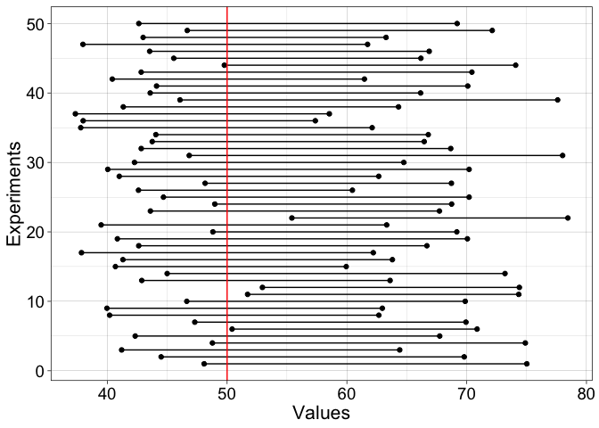

### Illustrate results: t-test

``` r
# fig.height=3, fig.width=2
df <- tibble(x = as.vector(ci.ttest),
             y = rep(1:nexp,2),
             gr = factor(rep(1:nexp,2))
            )
ggplot(df, aes(x = x, y = y)) + theme_linedraw() +
  geom_point() +
  geom_line(aes(group = gr)) +
  geom_vline(xintercept = n.m, colour = "red") +
  labs(x = "Values", y = "Experiments") +
  theme(axis.title = element_text(size = 16),
        axis.text = element_text(size = 14))
```

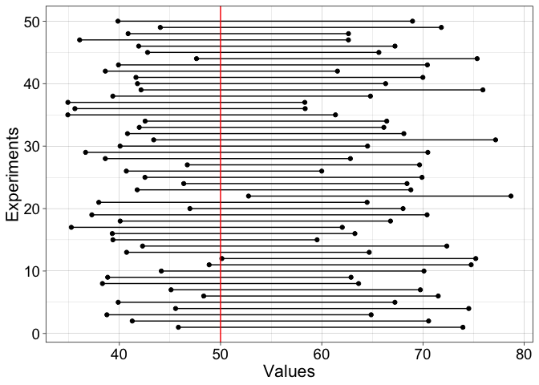

### Illustrate results: bootstrap vs. t-test

``` r
# fig.height=3, fig.width=2
dof <- 0.1 # dodge factor
df <- tibble(x = c(as.vector(ci[,1]),as.vector(ci.ttest[,1])),
             xend = c(as.vector(ci[,2]),as.vector(ci.ttest[,2])),
             y = c((1:nexp)-dof,(1:nexp)+dof),
             yend = c((1:nexp)-dof,(1:nexp)+dof),
             gr = factor(rep(1:nexp,2)),
             ci = factor(c(rep('bootstrap',nexp), rep('ttest',nexp)))
            )

ggplot(df, aes(x = x, y = y, xend = xend, yend = yend, colour = ci, group = gr)) + 
  theme_linedraw() +
  geom_segment() +
  scale_size_manual(values = c(1,0.5)) +
  geom_vline(xintercept = n.m, colour = "red") +
  labs(x = "Values", y = "Experiments") +
  theme(axis.title = element_text(size = 16),
        axis.text = element_text(size = 14))
```

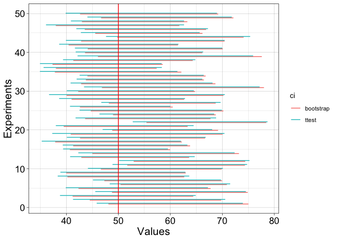

### Illustrate results: t-test with and without outlier

``` r
# fig.height=3, fig.width=2
dof <- 0.1 # dodge factor
df <- tibble(x = c(as.vector(ci.ttest.no[,1]),as.vector(ci.ttest[,1])),
             xend = c(as.vector(ci.ttest.no[,2]),as.vector(ci.ttest[,2])),
             y = c((1:nexp)-dof,(1:nexp)+dof),
             yend = c((1:nexp)-dof,(1:nexp)+dof),
             gr = factor(rep(1:nexp,2)),
             ci = factor(c(rep('No outlier',nexp), rep('Outlier',nexp)))
            )

ggplot(df, aes(x = x, y = y, xend = xend, yend = yend, colour = ci, group = gr)) + 
  theme_linedraw() +
  geom_segment() +
  scale_size_manual(values = c(1,0.5)) +
  geom_vline(xintercept = n.m, colour = "red") +
  labs(x = "Values", y = "Experiments") +
  theme(axis.title = element_text(size = 16),
        axis.text = element_text(size = 14)) +
  ggtitle("T-test confidence intervals")
```

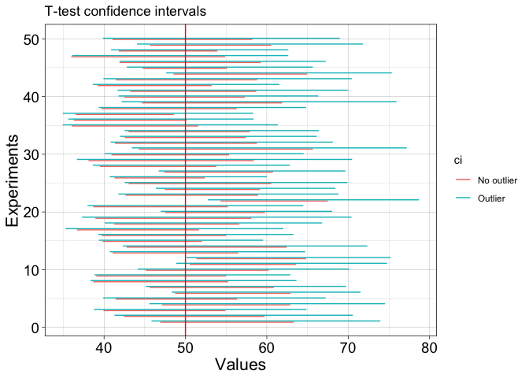

### Illustrate results: bootstrap with and without outlier

``` r
# fig.height=3, fig.width=2
dof <- 0.1 # dodge factor
df <- tibble(x = c(as.vector(ci.no[,1]),as.vector(ci[,1])),
             xend = c(as.vector(ci.no[,2]),as.vector(ci[,2])),
             y = c((1:nexp)-dof,(1:nexp)+dof),
             yend = c((1:nexp)-dof,(1:nexp)+dof),
             gr = factor(rep(1:nexp,2)),
             ci = factor(c(rep('No outlier',nexp), rep('Outlier',nexp)))
            )

ggplot(df, aes(x = x, y = y, xend = xend, yend = yend, colour = ci, group = gr)) + 
  theme_linedraw() +
  geom_segment() +
  scale_size_manual(values = c(1,0.5)) +
  geom_vline(xintercept = n.m, colour = "red") +
  labs(x = "Values", y = "Experiments") +
  theme(axis.title = element_text(size = 16),
        axis.text = element_text(size = 14)) +
  ggtitle("Bootstrap confidence intervals")
```

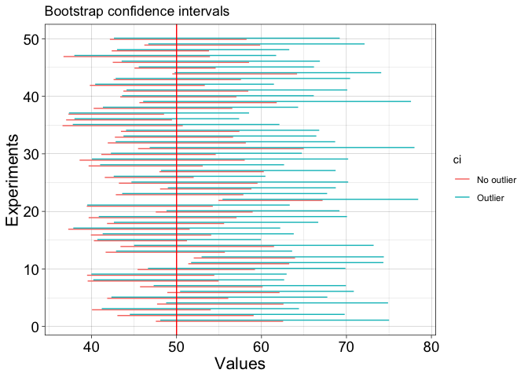

### Width variability: with outliers

Let's get more data

``` r
set.seed(21)

nboot <- 200
alpha <- .1
lo <- nboot*(alpha/2)
hi <- nboot - lo
lo <- lo + 1

nexp <- 1000 # number of experiments
n <- 20 # sample size in each experiment
n.m <- 50 # mean of normal distribution 
n.sd <- 20 # sd of normal distribution
ci <- matrix(NA, nrow = nexp, ncol = 2)
ci.ttest <- matrix(NA, nrow = nexp, ncol = 2)
for(E in 1:nexp){
  # sample data
  samp <- rnorm(n, n.m, n.sd)
  # replace largest observation by outlier
  samp <- sort(samp)
  samp[n] <- samp[n]*2 
  # bootstrap + compute mean of each bootstrap sample 
  boot.samp <- apply(matrix(sample(samp, n*nboot, replace = TRUE), nrow = nboot), 1, mean)
  sort.boot.samp <- sort(boot.samp) # sort bootstrap estimates
  ci[E,1] <- sort.boot.samp[lo] 
  ci[E,2] <- sort.boot.samp[hi]
  ci.ttest[E,] <- t.test(samp, conf.level = 1-alpha)$conf.int
}
```

Illustrate distribution of the width of the confidence intervals

``` r
df <- tibble(value = c(as.vector(ci[,2]-ci[,1]),
                       as.vector(ci.ttest[,2]-ci.ttest[,1])),
             ci = c(rep("bootstrap", nexp),rep("t-test", nexp))
             )
ggplot(df, aes(x = value, colour = ci)) +
  theme_linedraw() +
  geom_line(aes(y = ..density..), stat = 'density', size = 1) +
   theme(legend.position = c(0.1, 0.85),
        axis.title = element_text(size = 16),
        axis.text = element_text(size = 14),
        legend.text = element_text(size = 12),
      legend.title = element_text(size = 14)
       ) +
  scale_colour_manual(name = "Conf. int.", values = c("orange1", "blue")) +
  coord_cartesian(xlim = c(0, 35))
```

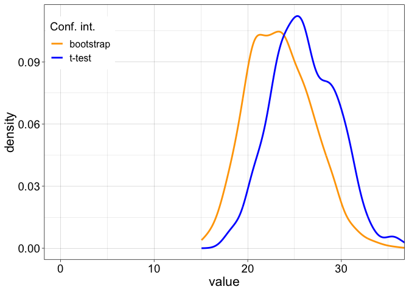

Scatterplot of width values

``` r
df <- tibble(bootstrap = as.vector(ci[,2]-ci[,1]),
             ttest = as.vector(ci.ttest[,2]-ci.ttest[,1]))
ggplot(df, aes(x = ttest, y = bootstrap)) +
  geom_point() +
  geom_abline(slope = 1, intercept = 0)
```

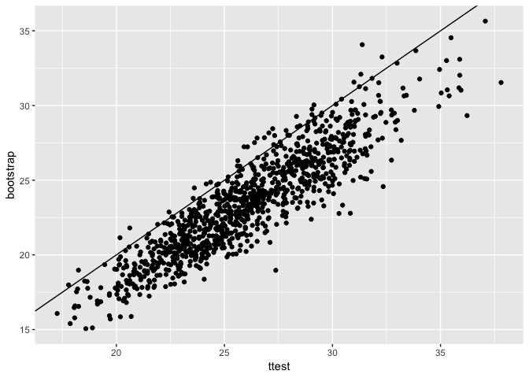

The t-test confidence intervals are systematically longer than the bootstrap ones.

### Coverage

How often does the confidence interval contain the population value? Is it as the nominal (expected) value?

``` r
mean(n.m > ci[,1] & n.m < ci[,2])
```

    ## [1] 0.91

### Coverage of standard confidence interval

How often does the confidence interval contain the population value? Is it as the nominal (expected) value?

``` r
mean(n.m > ci.ttest[,1] & n.m < ci.ttest[,2])
```

    ## [1] 0.971

Sample from a gamma distribution + bootstrap CI
-----------------------------------------------

``` r
nboot <- 1000
alpha <- .1
lo <- nboot*(alpha/2)
hi <- nboot - lo
lo <- lo + 1

nexp <- 50 # number of experiments
n <- 20 # sample size in each experiment

m <- 50 # mean of gamma distribution 
s <- 20 # sd of gamma distribution
location <- log(m^2 / sqrt(s^2 + m^2))
shape <- sqrt(log(1 + (s^2 / m^2)))

ci <- matrix(NA, nrow = nexp, ncol = 2)
ci.ttest <- matrix(NA, nrow = nexp, ncol = 2)

for(E in 1:nexp){
  # sample data + bootstrap + compute mean of each bootstrap sample
  samp <- rlnorm(n, meanlog = location, sdlog = shape)
  boot.samp <- apply(matrix(sample(samp, n*nboot, replace = TRUE), nrow = nboot), 1, mean)
  sort.boot.samp <- sort(boot.samp) # sort bootstrap estimates
  ci[E,1] <- sort.boot.samp[lo] 
  ci[E,2] <- sort.boot.samp[hi]
  ci.ttest[E,] <- t.test(samp, conf.level = 1-alpha)$conf.int
}
```

### Illustrate results: bootstrap CI

``` r
# fig.height=3, fig.width=2
df <- tibble(x = as.vector(ci),
             y = rep(1:nexp,2),
             gr = factor(rep(1:nexp,2))
            )
ggplot(df, aes(x = x, y = y)) + theme_linedraw() +
  geom_point() +
  geom_line(aes(group = gr)) +
  geom_vline(xintercept = m, colour = "red") +
  labs(x = "Values", y = "Experiments") +
  theme(axis.title = element_text(size = 16),
        axis.text = element_text(size = 14))
```

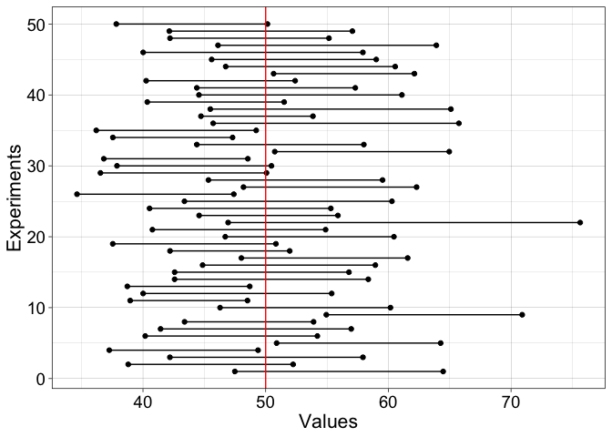

### Illustrate results: standard CI

``` r
# fig.height=3, fig.width=2
df <- tibble(x = as.vector(ci.ttest),
             y = rep(1:nexp,2),
             gr = factor(rep(1:nexp,2))
            )
ggplot(df, aes(x = x, y = y)) + theme_linedraw() +
  geom_point() +
  geom_line(aes(group = gr)) +
  geom_vline(xintercept = m, colour = "red") +
  labs(x = "Values", y = "Experiments") +
  theme(axis.title = element_text(size = 16),
        axis.text = element_text(size = 14))
```

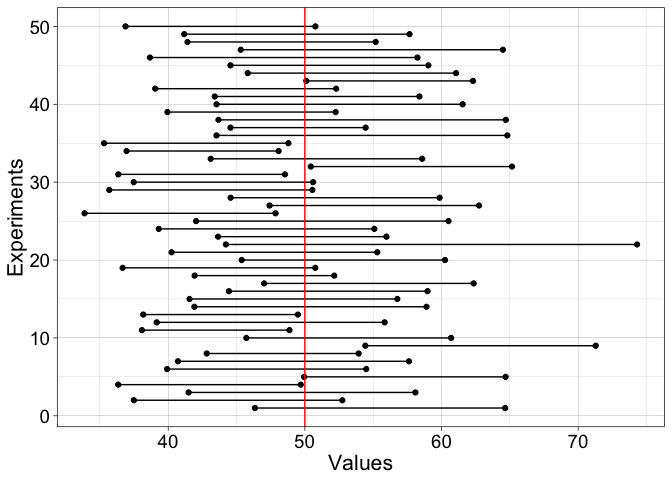

### Width variability

Let's get more data

``` r
set.seed(21)

nboot <- 200
alpha <- .1
lo <- nboot*(alpha/2)
hi <- nboot - lo
lo <- lo + 1

m <- 50 # mean of gamma distribution 
s <- 20 # sd of gamma distribution
location <- log(m^2 / sqrt(s^2 + m^2))
shape <- sqrt(log(1 + (s^2 / m^2)))

nexp <- 1000 # number of experiments
n <- 20 # sample size in each experiment
ci <- matrix(NA, nrow = nexp, ncol = 2)
ci.ttest <- matrix(NA, nrow = nexp, ncol = 2)
for(E in 1:nexp){
  # sample data + bootstrap + compute mean of each bootstrap sample
  samp <- rlnorm(n, meanlog = location, sdlog = shape)
  boot.samp <- apply(matrix(sample(samp, n*nboot, replace = TRUE), nrow = nboot), 1, mean)
  sort.boot.samp <- sort(boot.samp) # sort bootstrap estimates
  ci[E,1] <- sort.boot.samp[lo] 
  ci[E,2] <- sort.boot.samp[hi]
  ci.ttest[E,] <- t.test(samp, conf.level = 1-alpha)$conf.int
}
```

Illustrate distribution of the width of the confidence intervals

``` r
df <- tibble(value = c(as.vector(ci[,2]-ci[,1]),
                       as.vector(ci.ttest[,2]-ci.ttest[,1])),
             ci = c(rep("bootstrap", nexp),rep("t-test", nexp))
             )
ggplot(df, aes(x = value, colour = ci)) +
  theme_linedraw() +
  geom_line(aes(y = ..density..), stat = 'density', size = 1) +
   theme(legend.position = c(0.1, 0.85),
        axis.title = element_text(size = 16),
        axis.text = element_text(size = 14),
        legend.text = element_text(size = 12),
      legend.title = element_text(size = 14)
       ) +
  scale_colour_manual(name = "Conf. int.", values = c("orange1", "blue")) +
  coord_cartesian(xlim = c(0, 35))
```

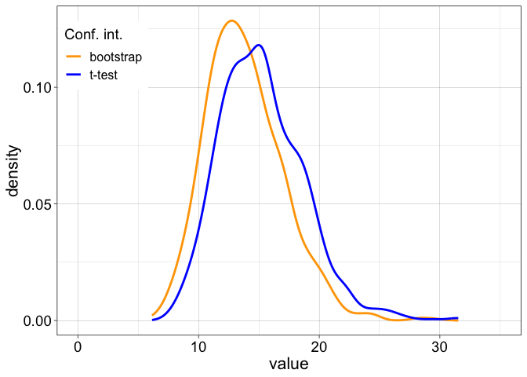

What happens if you change the sample size? Try n = 10 for instance. What happens if you decrease the number of boostrap samples? For instance, try nboot = 50.

### Coverage

How often does the bootstrap confidence interval contain the population value?

``` r
mean(m > ci[,1] & m < ci[,2])
```

    ## [1] 0.869

How often does the standard confidence interval contain the population value?

``` r
mean(m > ci.ttest[,1] & m < ci.ttest[,2])
```

    ## [1] 0.895

Take-home exercises
===================

-   Repeat for different nboot.
-   Plot mean width/coverage as a function of nboot and sample size.
-   look at confidence intervals for the trimmed mean and the median (check out Rand Wilcox's functions `trimci()` for trimmed means and `sintv2()` for medians).
-   What combination of sample size and bootstrap samples do you need for stable results for different estimators?
