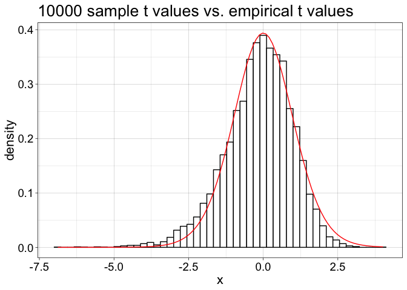

Bordeaux 2019 - robust stats - part 5: percentile-t bootstrap
================
Guillaume A. Rousselet
2019-03-26

-   [Functions from Rand Wilcox](#functions-from-rand-wilcox)
    -   [One-sample](#one-sample)
    -   [Two independent groups](#two-independent-groups)
    -   [Two dependent groups](#two-dependent-groups)
-   [Expected vs. empirical t distributions](#expected-vs.-empirical-t-distributions)
    -   [Population](#population)
    -   [Sampling distribution](#sampling-distribution)
    -   [One sample](#one-sample-1)
    -   [Theoretical t distribution](#theoretical-t-distribution)
    -   [Expected quantile to use in CI formula](#expected-quantile-to-use-in-ci-formula)
    -   [Sampling distribution of t](#sampling-distribution-of-t)
    -   [Sampling distribution of t + theoretical](#sampling-distribution-of-t-theoretical)
    -   [Different confidence intervals](#different-confidence-intervals)
-   [Percentile t-bootstrap confidence interval](#percentile-t-bootstrap-confidence-interval)
    -   [Bootstrap estimate of the sampling distribution of t](#bootstrap-estimate-of-the-sampling-distribution-of-t)
    -   [Superimpose t distributions](#superimpose-t-distributions)
    -   [Add ptb confidence interval](#add-ptb-confidence-interval)

``` r
# dependencies
library(ggplot2)
library(tibble)
source('./code/Rallfun-v35.txt')
```

``` r
sessionInfo()
```

    ## R version 3.5.2 (2018-12-20)
    ## Platform: x86_64-apple-darwin15.6.0 (64-bit)
    ## Running under: macOS Mojave 10.14.3
    ## 
    ## Matrix products: default
    ## BLAS: /Library/Frameworks/R.framework/Versions/3.5/Resources/lib/libRblas.0.dylib
    ## LAPACK: /Library/Frameworks/R.framework/Versions/3.5/Resources/lib/libRlapack.dylib
    ## 
    ## locale:
    ## [1] en_GB.UTF-8/en_GB.UTF-8/en_GB.UTF-8/C/en_GB.UTF-8/en_GB.UTF-8
    ## 
    ## attached base packages:
    ## [1] stats     graphics  grDevices utils     datasets  methods   base     
    ## 
    ## other attached packages:
    ## [1] tibble_2.0.1  ggplot2_3.1.0
    ## 
    ## loaded via a namespace (and not attached):
    ##  [1] Rcpp_1.0.0       knitr_1.21       magrittr_1.5     tidyselect_0.2.5
    ##  [5] munsell_0.5.0    colorspace_1.4-0 R6_2.4.0         rlang_0.3.1     
    ##  [9] stringr_1.4.0    plyr_1.8.4       dplyr_0.8.0.1    tools_3.5.2     
    ## [13] grid_3.5.2       gtable_0.2.0     xfun_0.4         withr_2.1.2     
    ## [17] htmltools_0.3.6  assertthat_0.2.0 yaml_2.2.0       lazyeval_0.2.1  
    ## [21] digest_0.6.18    crayon_1.3.4     purrr_0.3.0      glue_1.3.0      
    ## [25] evaluate_0.12    rmarkdown_1.11   stringi_1.3.1    compiler_3.5.2  
    ## [29] pillar_1.3.1     scales_1.0.0     pkgconfig_2.0.2

Functions from Rand Wilcox
==========================

One-sample
----------

``` r
# source('./code/Rallfun-v35.txt')
trimcibt(x, tr=0.2, alpha=0.1, nboot=1000, side=FALSE)
# tr = amount of trimming
# side = FALSE for an equal-tailed confidence interval
# side = TRUE for a symmetric confidence interval
```

Two independent groups
----------------------

That's the one you could try on your data.

``` r
yuenbt(x,y,tr=0.2,alpha=0.05,nboot=599,side=FALSE)
```

Two dependent groups
--------------------

``` r
ydbt(x,y,tr=0.2,alpha=0.05,nboot=599,side=FALSE,plotit=TRUE,op=1)
```

Expected vs. empirical t distributions
======================================

Population
----------

``` r
m <- 50
s <- 20
location <- log(m^2 / sqrt(s^2 + m^2))
shape <- sqrt(log(1 + (s^2 / m^2)))

ggplot(data.frame(x = c(0, 130)), aes(x)) + theme_linedraw() +
  stat_function(fun = dlnorm, args = list(meanlog = location, sdlog = shape)) + 
labs(y = "Density") +
  theme(axis.text = element_text(size = 14),
        axis.title = element_text(size = 16),
        plot.title = element_text(size=20)) +
  ggtitle(paste0("Log normal distribution: mean = ",m,", sd = ",s))
```


``` r
 # ggsave(filename = './lnorm_dist.pdf')
```

Sampling distribution
---------------------

``` r
set.seed(111) 
n <- 20
nsim <- 10000
samp.dist <- apply(matrix(rlnorm(n*nsim, location, shape),nrow = nsim), 1, mean)

ggplot(data.frame(x=samp.dist), aes(x)) + theme_linedraw() +
  geom_histogram(aes(y = ..density..), colour = "black", fill = "white", bins = 50) +
  theme(axis.text = element_text(size = 14),
        axis.title = element_text(size = 16),
        plot.title = element_text(size=20)) +
  ggtitle(paste(nsim,"sample means: mean =",round(mean(samp.dist),digits=1),", sd = ",round(sd(samp.dist),digits=2)))
```


``` r
# ggsave(filename = './lnorm_sampdist.pdf')
```

One sample
----------

``` r
set.seed(4)
n <- 20
samp <- rlnorm(n, location, shape)
t.test(samp)
```

    ## 
    ##  One Sample t-test
    ## 
    ## data:  samp
    ## t = 13.73, df = 19, p-value = 2.583e-11
    ## alternative hypothesis: true mean is not equal to 0
    ## 95 percent confidence interval:
    ##  47.64831 64.78881
    ## sample estimates:
    ## mean of x 
    ##  56.21856

``` r
# T-value: define function
tval <- function(x,nv){
  tval <- (mean(x) - nv) / sqrt(var(x)/length(x))
  tval
}
```

Theoretical t distribution
--------------------------

``` r
df <- n-1

ggplot(data.frame(x = c(-5, 5)), aes(x)) + theme_linedraw() +
  stat_function(fun = dt, args = list(df = df)) + 
labs(y = "Density") +
  theme(axis.text = element_text(size = 14),
        axis.title = element_text(size = 16),
        plot.title = element_text(size=20)) +
  ggtitle(paste0("t distribution: df = ",df))
```


``` r
# ggsave(filename = './theor_t.pdf')
```

Expected quantile to use in CI formula
--------------------------------------

``` r
alpha <- 0.05
qt.th<- qt(1-alpha/2, df)
qt.th
```

    ## [1] 2.093024

Sampling distribution of t
--------------------------

``` r
set.seed(111) 
n <- 20
nsim <- 10000
samp.dist <- apply(matrix(rlnorm(n*nsim, location, shape),nrow = nsim), 1, tval, nv = m)

ggplot(data.frame(x=samp.dist), aes(x)) + theme_linedraw() +
  geom_histogram(aes(y=..density..), 
                 colour = "black", fill = "white", bins = 50) +
  # stat_function(fun = dt, args = list(df = df)) + 
  theme(axis.text = element_text(size = 14),
        axis.title = element_text(size = 16),
        plot.title = element_text(size=20)) +
  ggtitle(paste(nsim,"sample t values: mean =",round(mean(samp.dist),digits=1)))
```


``` r
# ggsave(filename = './sampdist_t.pdf')
```

Sampling distribution of t + theoretical
----------------------------------------

``` r
set.seed(111) 
n <- 20
nsim <- 10000
samp.dist <- apply(matrix(rlnorm(n*nsim, location, shape),nrow = nsim), 1, tval, nv = m)

ggplot(data.frame(x=samp.dist), aes(x)) + theme_linedraw() +
  geom_histogram(aes(y=..density..), 
                 colour = "black", fill = "white", bins = 50) +
  stat_function(fun = dt, args = list(df = df), colour = "red") + 
  theme(axis.text = element_text(size = 14),
        axis.title = element_text(size = 16),
        plot.title = element_text(size=20)) +
  ggtitle(paste(nsim,"sample t values vs. empirical t values"))
```



``` r
# ggsave(filename = './comp_theor_samp_t.pdf')
```

``` r
# quantiles based on sampling distribution
qt.emp <- quantile(samp.dist, c(alpha/2, 1-(alpha/2)))
```

``` r
# sampling distribution of t + theoretical:
# quantile t values
set.seed(111) 
n <- 20
nsim <- 10000
samp.dist <- apply(matrix(rlnorm(n*nsim, location, shape),nrow = nsim), 1, tval, nv = m)

ggplot(data.frame(x=samp.dist), aes(x)) + theme_linedraw() +
  geom_histogram(aes(y=..density..), 
                 colour = "black", fill = "white", bins = 50) +
  geom_vline(xintercept = qt.emp, colour = "black", size = 1.5) +
  geom_vline(xintercept = c(-qt.th,qt.th) , colour = "red", size = 1.5) +
  stat_function(fun = dt, args = list(df = df), colour = "red") + 
  theme(axis.text = element_text(size = 14),
        axis.title = element_text(size = 16),
        plot.title = element_text(size=20)) +
  ggtitle(paste(nsim,"sample t values vs. empirical t values"))
```


``` r
# ggsave(filename = './comp_theor_samp_t_q.pdf')
```

Different confidence intervals
------------------------------

Standard confidence interval using t value theoretical sampling distribution

``` r
set.seed(21)
n <- 20
samp <- rlnorm(n, location, shape)
ci.st <- t.test(samp)$conf.int
ggplot(data = data.frame(x = rep("gr", n), y = samp), aes(x=x,y=y)) +
  theme_linedraw() +
  theme(axis.title = element_blank(),
        axis.text.y = element_blank()) +
  geom_jitter(alpha = 0.5) +
  geom_hline(yintercept = mean(samp)) +
  geom_segment(y = ci.st[1], yend = ci.st[2], x = 1, xend = 1, colour = "red") +
  scale_y_continuous(breaks = seq(20, 100, 10)) +
  coord_flip()
```


``` r
# ggsave(filename = './ci1.pdf')
```

Check values

``` r
ci.st
```

    ## [1] 42.79981 64.05162
    ## attr(,"conf.level")
    ## [1] 0.95

Check confidence interval by hand

``` r
alpha <- 0.05
df <- n-1 # degrees of freedom
samp.m <- mean(samp)
sem <- sd(samp) / sqrt(n)
ci <- vector("numeric",2)
ci[1] <- samp.m - qt(1-alpha/2, df)  * sem
ci[2] <- samp.m + qt(1-alpha/2, df)  * sem
ci
```

    ## [1] 42.79981 64.05162

Confidence interval using empiricial t value sampling distribution

``` r
alpha <- 0.05
df <- n-1 # degrees of freedom
samp.m <- mean(samp)
sem <- sd(samp) / sqrt(n)
ci.emp <- vector("numeric",2)
ci.emp[1] <- samp.m - qt.emp[2]  * sem
ci.emp[2] <- samp.m - qt.emp[1]  * sem
ci.emp
```

    ## [1] 44.43879 66.98840

Add CI using empirical t distribution

``` r
set.seed(21)
n <- 20
samp <- rlnorm(n, location, shape)
ci.st <- t.test(samp)$conf.int
ggplot(data = data.frame(x = rep("gr", n), y = samp), aes(x=x,y=y)) +
  theme_linedraw() +
  theme(axis.title = element_blank(),
        axis.text.y = element_blank()) +
  geom_jitter(alpha = 0.5) +
  geom_hline(yintercept = mean(samp)) +
  geom_segment(y = ci.st[1], yend = ci.st[2], x = 1, xend = 1, colour = "red") +
  geom_segment(y = ci.emp[1], yend = ci.emp[2], x = 1.05, xend = 1.05, colour = "black") +
  scale_y_continuous(breaks = seq(20, 100, 10)) +
  coord_flip()
```


``` r
# ggsave(filename = './ci2.pdf')
```

Percentile t-bootstrap confidence interval
==========================================

``` r
set.seed(333)
out <- trimcibt(samp, tr=0, alpha=0.05, nboot=1000, side=FALSE, SEED = FALSE)
```

    ## [1] "NOTE: p.value is computed only when side=T"

``` r
out
```

    ## $estimate
    ## [1] 53.42572
    ## 
    ## $ci
    ## [1] 43.91411 65.62998
    ## 
    ## $test.stat
    ## [1] 10.52346
    ## 
    ## $p.value
    ## [1] NA
    ## 
    ## $n
    ## [1] 20

Bootstrap estimate of the sampling distribution of t
----------------------------------------------------

``` r
set.seed(333)
nboot <- 1000
tr <- 0
alpha <- 0.05 
ibot <- round(alpha*nboot/2)
itop <- nboot-ibot
sem <- sd(samp)/sqrt(n)
samp.m <- mean(samp, tr)
# mean centre the data
csamp <- samp - mean(samp, trim = tr)
# sample with replacement
bootdata <- matrix(sample(csamp,size=n*nboot,replace=TRUE),nrow=nboot)
boot.tval <- sort(apply(bootdata,1,mean,tr) / (apply(bootdata,1,sd,tr) / sqrt(n)))
ci.ptb <- samp.m - boot.tval[itop] * sem
ci.ptb[2] <- samp.m - boot.tval[ibot] * sem
ci.ptb
```

    ## [1] 43.91411 65.62998

Superimpose t distributions
---------------------------

Histogram (black) = sampling distribution Red = theoretical Green = bootstrap t distribution

``` r
# sampling distribution of t + theoretical
set.seed(111) 
n <- 20
nsim <- 10000
samp.dist <- apply(matrix(rlnorm(n*nsim, location, shape),nrow = nsim), 1, tval, nv = m)

ggplot(data.frame(x=samp.dist), aes(x)) + theme_linedraw() +
  geom_histogram(aes(y=..density..), 
                 colour = "black", fill = "white", bins = 50) +
  stat_function(fun = dt, args = list(df = df), colour = "red", size = 1) + 
  geom_line(data=tibble(x = boot.tval), aes(x=x, y = ..density..), 
            stat = 'density', colour = "green3", size = 1) + 
  theme(axis.text = element_text(size = 14),
        axis.title = element_text(size = 16),
        plot.title = element_text(size=18)) +
  ggtitle(paste(nsim,"sample t values / theoretical t (red) / boot t (green)"))
```


``` r
ggsave(filename = './comp_theor_samp_boot_t.pdf')
```

    ## Saving 7 x 5 in image

Add ptb confidence interval
---------------------------

``` r
set.seed(21)
n <- 20
samp <- rlnorm(n, location, shape)
ci.st <- t.test(samp)$conf.int
ggplot(data = data.frame(x = rep("gr", n), y = samp), aes(x=x,y=y)) +
  theme_linedraw() +
  theme(axis.title = element_blank(),
        axis.text.y = element_blank()) +
  geom_jitter(alpha = 0.5) +
  geom_hline(yintercept = mean(samp)) +
  geom_segment(y = ci.st[1], yend = ci.st[2], x = 1, xend = 1, colour = "red") +
  geom_segment(y = ci.emp[1], yend = ci.emp[2], x = 1.05, xend = 1.05, colour = "black") +
  geom_segment(y = out$ci[1], yend = out$ci[2], x = 0.95, xend = 0.95, colour = "green3") +
  scale_y_continuous(breaks = seq(20, 100, 10)) +
  coord_flip()
```


``` r
# ggsave(filename = './ci3.pdf')
```
