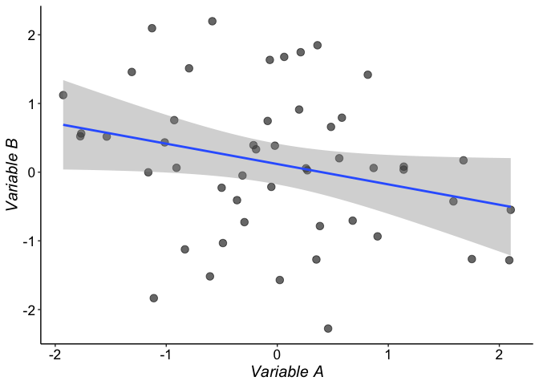
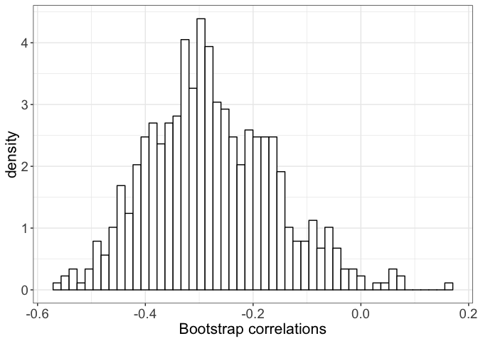
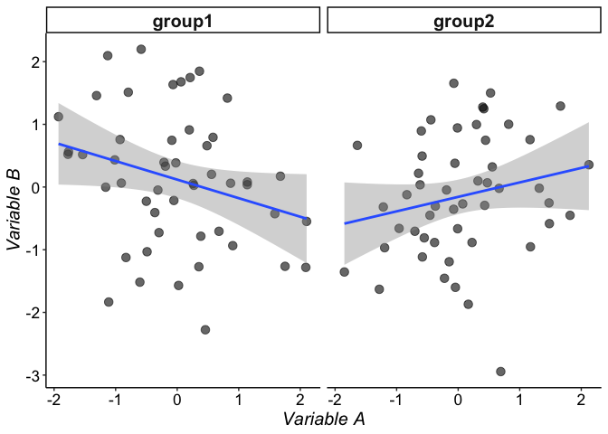
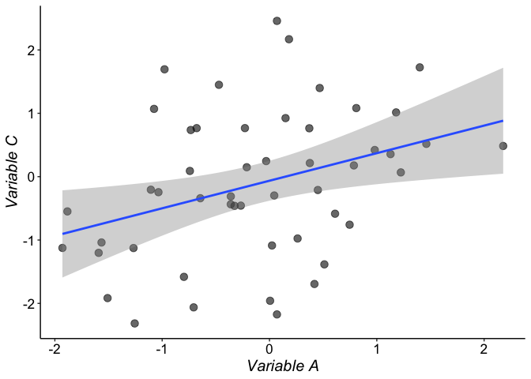
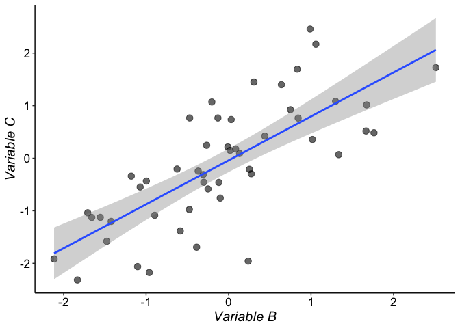

Bordeaux 2019 - robust stats - part 6: correlation
================
Guillaume A. Rousselet
2019-03-26

-   [Generate data](#generate-data)
-   [Pearson's correlation](#pearsons-correlation)
-   [Percentile bootstrap confidence interval](#percentile-bootstrap-confidence-interval)
    -   [Pearson correlation](#pearson-correlation)
    -   [percentage bend correlation](#percentage-bend-correlation)
    -   [25% Winsorized correlation](#winsorized-correlation)
    -   [skipped correlation: Pearson](#skipped-correlation-pearson)
    -   [skipped correlation: Spearman](#skipped-correlation-spearman)
-   [Compare correlations](#compare-correlations)
    -   [Independent case](#independent-case)
    -   [Dependent case](#dependent-case)

``` r
# dependencies
library(ggplot2)
library(tibble)
source("./code/Rallfun-v35.txt")
```

``` r
sessionInfo()
```

    ## R version 3.5.2 (2018-12-20)
    ## Platform: x86_64-apple-darwin15.6.0 (64-bit)
    ## Running under: macOS Mojave 10.14.3
    ## 
    ## Matrix products: default
    ## BLAS: /Library/Frameworks/R.framework/Versions/3.5/Resources/lib/libRblas.0.dylib
    ## LAPACK: /Library/Frameworks/R.framework/Versions/3.5/Resources/lib/libRlapack.dylib
    ## 
    ## locale:
    ## [1] en_GB.UTF-8/en_GB.UTF-8/en_GB.UTF-8/C/en_GB.UTF-8/en_GB.UTF-8
    ## 
    ## attached base packages:
    ## [1] stats     graphics  grDevices utils     datasets  methods   base     
    ## 
    ## other attached packages:
    ## [1] tibble_2.0.1  ggplot2_3.1.0
    ## 
    ## loaded via a namespace (and not attached):
    ##  [1] Rcpp_1.0.0       knitr_1.21       magrittr_1.5     tidyselect_0.2.5
    ##  [5] munsell_0.5.0    colorspace_1.4-0 R6_2.4.0         rlang_0.3.1     
    ##  [9] stringr_1.4.0    plyr_1.8.4       dplyr_0.8.0.1    tools_3.5.2     
    ## [13] grid_3.5.2       gtable_0.2.0     xfun_0.4         withr_2.1.2     
    ## [17] htmltools_0.3.6  assertthat_0.2.0 yaml_2.2.0       lazyeval_0.2.1  
    ## [21] digest_0.6.18    crayon_1.3.4     purrr_0.3.0      glue_1.3.0      
    ## [25] evaluate_0.12    rmarkdown_1.11   stringi_1.3.1    compiler_3.5.2  
    ## [29] pillar_1.3.1     scales_1.0.0     pkgconfig_2.0.2

Generate data
=============

In this example we sample from 2 uncorrelated variables. By chance there seems to be a non negligeable correlation. Changing the random seed or commenting out the line `set.seed(21)` will give different results. You can also sample trials from variables with a true correlation by changing `rho`.

``` r
set.seed(21)
n <- 50 # sample size
mu <- c(0, 0) # means of the variables
rho <- 0 # correlation between variables
sigma <- matrix(c(1, rho, rho, 1), nrow = 2, byrow = TRUE) # covariance matrix
data <- MASS::mvrnorm(n = n, mu = mu, Sigma = sigma)
x <- data[,1]
y <- data[,2]

# make data frame
df <- tibble(x = x,
             y = y)

# ggplot figure
ggplot(df, aes(x = x, y = y)) + theme_classic() +
  # geom_hline(yintercept = 0) +
  # geom_vline(xintercept = 0) +
  geom_point(alpha = 0.6, size = 3) +
  geom_smooth(method='lm',formula=y~x) +
  theme(axis.title = element_text(size = 15, colour = "black"),
        axis.text = element_text(size = 13, colour = "black"),
        strip.text = element_text(size = 15, face = "bold")) +
  # scale_x_continuous(limits = c(-4, 4),
  #                    breaks = seq(-4, 4, 1)) +
  labs(x = expression(italic("Variable A")), y = expression(italic("Variable B")))
```



``` r
# ggsave(filename = "./corr_samp.pdf")
```

Pearson's correlation
=====================

``` r
out <- cor.test(x,y, method = "pearson")
out
```

    ## 
    ##  Pearson's product-moment correlation
    ## 
    ## data:  x and y
    ## t = -1.9622, df = 48, p-value = 0.05555
    ## alternative hypothesis: true correlation is not equal to 0
    ## 95 percent confidence interval:
    ##  -0.512010705  0.006329091
    ## sample estimates:
    ##        cor 
    ## -0.2724987

Percentile bootstrap confidence interval
========================================

Pearson correlation
-------------------

``` r
pcorb(x,y, SEED = FALSE)
```

    ## $r
    ## [1] -0.2724987
    ## 
    ## $ci
    ## [1] -0.5155597 -0.0107188

### Pearson correlation: detailed code

``` r
set.seed(21)
nboot <- 599
# sample pairs of observations with replacement
data <- matrix(sample(length(y),size=length(y)*nboot,replace=TRUE),nrow=nboot)
# compute correlation for each pair
bvec <- apply(data,1,pcorbsub,x,y) # A 1 by nboot matrix.
# confidence interval is computed using special adjustments to account for heteroscedasticity
ilow<-15
ihi<-584
if(length(y) < 250){
ilow<-14
ihi<-585
}
if(length(y) < 180){
ilow<-11
ihi<-588
}
if(length(y) < 80){
ilow<-8
ihi<-592
}
if(length(y) < 40){
ilow<-7
ihi<-593
}
bsort <- sort(bvec)
ci <-c (bsort[ilow],bsort[ihi])

ggplot(enframe(bvec, name = NULL), aes(x = value)) + theme_bw() +
  geom_histogram(aes(y = ..density..), bins = 50,
                 fill = "white", colour = "black") +
  theme(axis.text = element_text(size = 14),
        axis.title = element_text(size = 16)) +
  labs(x = "Bootstrap correlations") 
```



``` r
# ggsave(filename = "./pboot_dist.pdf")
```

percentage bend correlation
---------------------------

``` r
corb(x,y, corfun = pbcor, SEED = FALSE)
```

    ## $cor.ci
    ## [1] -0.49637489  0.02030406
    ## 
    ## $p.value
    ## [1] 0.06677796
    ## 
    ## $cor.est
    ## [1] -0.2502435

25% Winsorized correlation
--------------------------

``` r
corb(x,y, corfun=wincor, tr=0.25, SEED = FALSE)
```

    ## $cor.ci
    ## [1] -0.51192940  0.07599039
    ## 
    ## $p.value
    ## [1] 0.1268781
    ## 
    ## $cor.est
    ## [1] -0.2251957

skipped correlation: Pearson
----------------------------

``` r
mscor(cbind(x,y),corfun=pcor)
```

    ## 
    ## Attaching package: 'MASS'

    ## The following object is masked _by_ '.GlobalEnv':
    ## 
    ##     ltsreg

    ## $cor
    ##            [,1]       [,2]
    ## [1,]  1.0000000 -0.2724987
    ## [2,] -0.2724987  1.0000000
    ## 
    ## $crit.val
    ## [1] 2.48066
    ## 
    ## $test.stat
    ##          [,1]     [,2]
    ## [1,]       NA 1.962183
    ## [2,] 1.962183       NA

skipped correlation: Spearman
-----------------------------

``` r
mscor(cbind(x,y),corfun=spear)
```

    ## $cor
    ##            x          y
    ## x  1.0000000 -0.2632893
    ## y -0.2632893  1.0000000
    ## 
    ## $crit.val
    ## [1] 2.48066
    ## 
    ## $test.stat
    ##          x        y
    ## x       NA 1.890836
    ## y 1.890836       NA

Compare correlations
====================

The design of the study presented in Davis et al. (2008) is a mix between the independent and dependent cases: there are 2 independent groups, and for each group there are 3 dependent measurements. To build confidence intervals for the differences of differences between correlations, you would need to write your own code. Let's look at the simpler cases.

Independent case
----------------

Generate data

``` r
set.seed(21)
n <- 50 # sample size
mu <- c(0, 0) # means of the variables
rho <- 0 # correlation between variables
sigma <- matrix(c(1, rho, rho, 1), nrow = 2, byrow = TRUE) # covariance matrix

# group 1
data <- MASS::mvrnorm(n = n, mu = mu, Sigma = sigma)
x1 <- data[,1]
y1 <- data[,2]

# group 2
data <- MASS::mvrnorm(n = n, mu = mu, Sigma = sigma)
x2 <- data[,1]
y2 <- data[,2]

# make data frame
df <- tibble(x = c(x1, x2),
             y = c(y1, y2),
             group = factor(c(rep("group1",n),rep("group2",n))))

# ggplot figure
ggplot(df, aes(x = x, y = y)) + theme_classic() +
  # geom_hline(yintercept = 0) +
  # geom_vline(xintercept = 0) +
  geom_point(alpha = 0.6, size = 3) +
  geom_smooth(method='lm',formula=y~x) +
  theme(axis.title = element_text(size = 15, colour = "black"),
        axis.text = element_text(size = 13, colour = "black"),
        strip.text = element_text(size = 15, face = "bold")) +
  # scale_x_continuous(limits = c(-4, 4),
  #                    breaks = seq(-4, 4, 1)) +
  labs(x = expression(italic("Variable A")), y = expression(italic("Variable B"))) +
  facet_grid(cols = vars(group))
```



``` r
 # ggsave(filename = "./corr_samp_ind.pdf")
```

### Two Pearson correlations

``` r
twopcor(x1,y1,x2,y2, SEED = FALSE)
```

    ## [1] "Taking bootstrap samples; please wait"

    ## $r1
    ## [1] -0.2724987
    ## 
    ## $r2
    ## [1] 0.2091963
    ## 
    ## $ci
    ## [1] -0.8432464 -0.1389061

### Two robust correlations

``` r
twocor(x1,y1,x2,y2, corfun = pbcor)
```

    ## $r1
    ## [1] -0.2502435
    ## 
    ## $r2
    ## [1] 0.2583944
    ## 
    ## $ci.dif
    ## [1] -0.8690095 -0.1391154
    ## 
    ## $p.value
    ## [1] 0.003338898

Dependent case
--------------

### Overlapping case

For instance, if we have 3 dependent variables, we want to compare the correlation between 1 and 3 to the correlation between 2 and 3.

Generate data

``` r
set.seed(21)
n <- 50 # sample size
mu <- c(0, 0, 0) # means of the variables
rho12 <- 0.8 # correlation between variables 1 and 2
rho13 <- 0.2 # correlation between variables 1 and 3
rho23 <- 0.6 # correlation between variables 2 and 3
# define covariance matrix
sigma <- matrix(c(1, rho12, rho13, 
                  rho12, 1, rho23,
                  rho13, rho23, 1), 
                nrow = 3, byrow = TRUE) 

data <- MASS::mvrnorm(n = n, mu = mu, Sigma = sigma)
x <- data[,1:2]
y <- data[,3]

# make data frame
df <- tibble(x = x[,1],
             y = y)
# ggplot figure
ggplot(df, aes(x = x, y = y)) + theme_classic() +
  geom_point(alpha = 0.6, size = 3) +
  geom_smooth(method='lm',formula=y~x) +
  theme(axis.title = element_text(size = 15, colour = "black"),
        axis.text = element_text(size = 13, colour = "black"),
        strip.text = element_text(size = 15, face = "bold")) +
  # scale_x_continuous(limits = c(-4, 4),
  #                    breaks = seq(-4, 4, 1)) +
  labs(x = expression(italic("Variable A")), y = expression(italic("Variable C")))
```



``` r
 # ggsave(filename = "./corr_samp_dep_ov1.pdf")
 
 # make data frame
df <- tibble(x = x[,2],
             y = y)
# ggplot figure
ggplot(df, aes(x = x, y = y)) + theme_classic() +
  geom_point(alpha = 0.6, size = 3) +
  geom_smooth(method='lm',formula=y~x) +
  theme(axis.title = element_text(size = 15, colour = "black"),
        axis.text = element_text(size = 13, colour = "black"),
        strip.text = element_text(size = 15, face = "bold")) +
  # scale_x_continuous(limits = c(-4, 4),
  #                    breaks = seq(-4, 4, 1)) +
  labs(x = expression(italic("Variable B")), y = expression(italic("Variable C")))
```



``` r
 # ggsave(filename = "./corr_samp_dep_ov2.pdf")
```

For Pearson correlation:

``` r
# x = matrix with 2 columns
# y = vector
TWOpov(x,y)
```

    ## $est.rho1
    ## [1] 0.349879
    ## 
    ## $est.rho2
    ## [1] 0.7459425
    ## 
    ## $ci
    ##   ci.lower   ci.upper 
    ## -0.5358359 -0.2562911

``` r
#TWOpovPV to get a p-value
```

For a robust correlation:

``` r
twoDcorR(x,y, corfun=wincor, SEED=FALSE)
```

    ## $est.rho1
    ## [1] 0.3115092
    ## 
    ## $est.rho2
    ## [1] 0.7897376
    ## 
    ## $est.dif
    ## [1] -0.4782284
    ## 
    ## $ci
    ## [1] -0.7070912 -0.2483081
    ## 
    ## $p.value
    ## [1] 0

### Non-overlapping case

For instance, if we have 4 dependent variables, we want to compare the correlation between 1 and 2 to the correlation between 3 and 4.

For Pearson correlation:

``` r
# x = matrix with 2 columns
# y = matrix with 2 columns
TWOpNOV(x,y)
```

For a robust correlation:

``` r
twoDNOV(x,y, corfun=wincor, SEED=FALSE)
```
